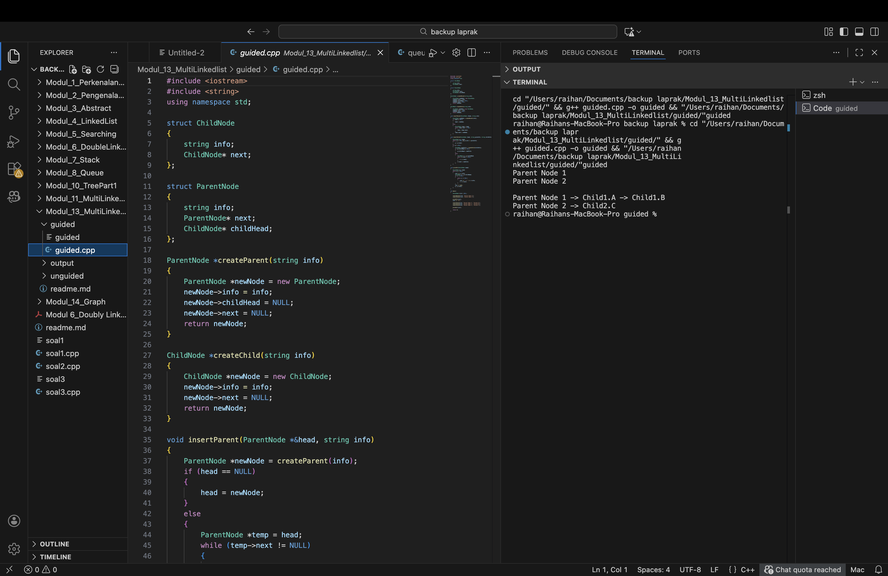
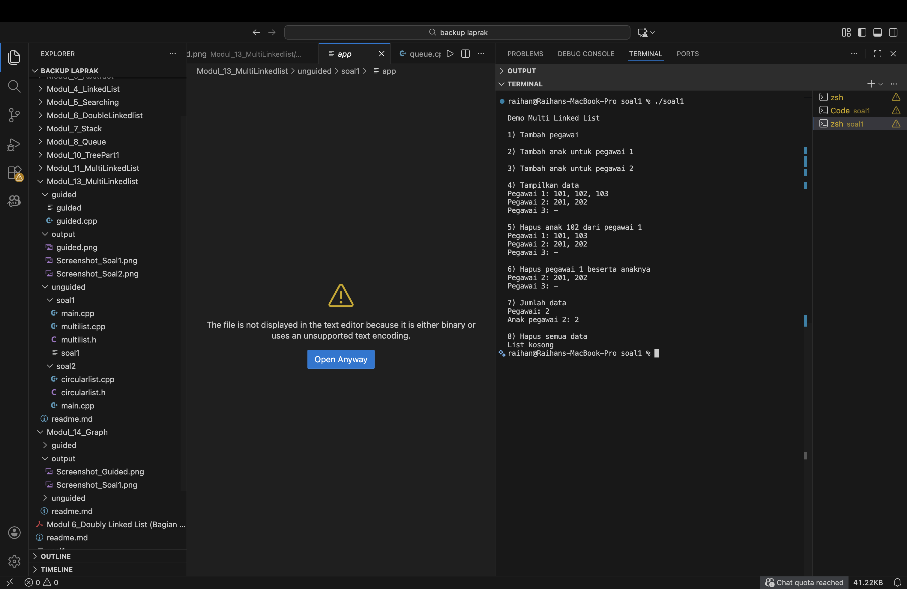
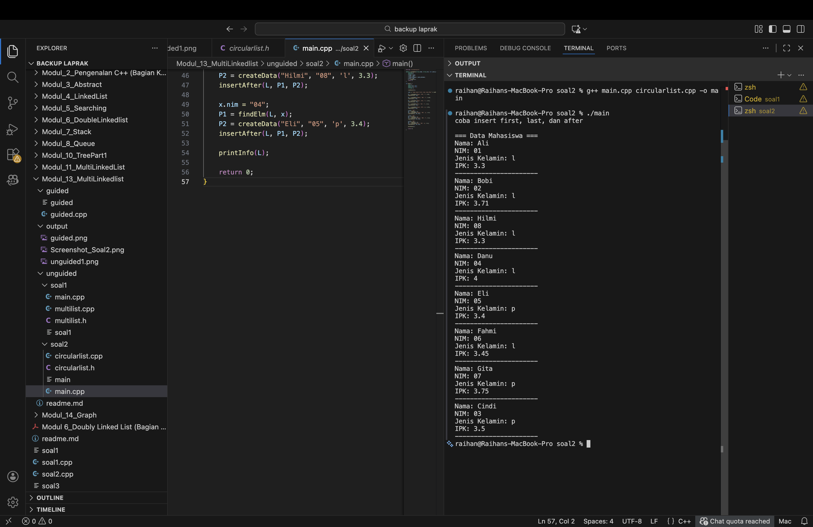

# <h1 align="center">Laporan Praktikum Modul 13 <br>Multi Linked List</h1>

<p align="center">Raihan Adi Arba - 103112400071</p>

## Dasar Teori

Multi Linked List adalah struktur data yang menggabungkan konsep linked list dengan relasi hierarki antar data. Dalam struktur ini, setiap node pada list utama atau parent dapat memiliki pointer tambahan yang menunjuk ke list lain sebagai child atau sub-list. Konsep ini memungkinkan kita untuk merepresentasikan hubungan satu-ke-banyak dalam satu struktur data yang efisien.

Berbeda dengan single linked list yang hanya memiliki satu pointer next untuk menghubungkan antar node, multi linked list memiliki struktur yang lebih kompleks. Setiap node parent tidak hanya memiliki pointer ke node parent berikutnya, tetapi juga memiliki pointer yang menunjuk ke kepala dari child list miliknya. Struktur seperti ini sangat berguna untuk merepresentasikan data yang memiliki hubungan hierarkis seperti data pegawai dengan anak-anaknya, kategori produk dengan item-itemnya, atau organisasi dengan departemen-departemennya.

Implementasi multi linked list biasanya melibatkan dua struktur node yang berbeda, yaitu struktur untuk parent node dan struktur untuk child node. Parent node berisi informasi data utama, pointer ke parent node berikutnya, dan pointer ke child list. Sedangkan child node berisi informasi data turunan dan pointer ke child node berikutnya. Untuk mengakses data dalam multi linked list, kita perlu melakukan traversal bertingkat, yaitu pertama mengakses parent node lalu mengakses child node yang terkait.

Circular Linked List adalah variasi dari linked list dimana node terakhir tidak menunjuk ke NULL melainkan kembali menunjuk ke node pertama sehingga membentuk lingkaran. Struktur ini memungkinkan traversal tanpa batas dan berguna untuk implementasi antrian berputar atau sistem yang memerlukan akses berulang dari awal ke akhir.

## Guided

### Guided 1 - Multi Linked List Sederhana

```cpp
#include <iostream>
#include <string>
using namespace std;

struct ChildNode
{
    string info;
    ChildNode* next;
};

struct ParentNode
{
    string info;
    ParentNode* next;
    ChildNode* childHead;
};

ParentNode *createParent(string info)
{
    ParentNode *newNode = new ParentNode;
    newNode->info = info;
    newNode->childHead = NULL;
    newNode->next = NULL;
    return newNode;
}

ChildNode *createChild(string info)
{
    ChildNode *newNode = new ChildNode;
    newNode->info = info;
    newNode->next = NULL;
    return newNode;
}

void insertParent(ParentNode *&head, string info)
{
    ParentNode *newNode = createParent(info);
    if (head == NULL)
    {
        head = newNode;
    }
    else
    {
        ParentNode *temp = head;
        while (temp->next != NULL)
        {
            temp = temp->next;
        }
        temp->next = newNode;
    }
}

void insertChild(ParentNode *head, string parenInfo, string childInfo)
{
    ParentNode *p = head;
    while (p != NULL && p->info != parenInfo)
    {
        p = p->next;
    }
    if (p != NULL)
    {
        ChildNode *newChild = createChild(childInfo);
        if (p->childHead == NULL)
        {
            p->childHead = newChild;
        }
        else
        {
            ChildNode *c = p->childHead;
            while (c->next != NULL)
            {
                c = c->next;
            }
            c->next = newChild;
        }
    }
}

void printAll(ParentNode *head)
{
    ParentNode *p = head;
    while (p != NULL)
    {
        cout << p ->info;
        ChildNode *c = p->childHead;
        if (c != NULL)
        {
            while (c != NULL)
            {
                cout << " -> " << c->info;
                c = c->next;
            }
        }
        cout << endl;
        p = p->next;
    }
}

int main()
{
    ParentNode *list = NULL;

    insertParent(list, "Parent Node 1");
    insertParent(list, "Parent Node 2");

    printAll(list);
    cout << "\n";

    insertChild(list, "Parent Node 1", "Child1.A");
    insertChild(list, "Parent Node 1", "Child1.B");
    insertChild(list, "Parent Node 2", "Child2.C");

    printAll(list);

    return 0;
}
```

> 

Ringkasan hasil: Awalnya ditampilkan dua parent tanpa anak. Setelah penambahan child, "Parent Node 1" memiliki "Child1.A" dan "Child1.B", sedangkan "Parent Node 2" memiliki "Child2.C".

Program ini menunjukkan implementasi dasar dari multi linked list dengan konsep parent-child. Pertama-tama dibuat dua struktur berbeda yaitu ChildNode untuk menyimpan data child dan ParentNode untuk menyimpan data parent dimana di dalamnya ada pointer childHead yang menunjuk ke list anak-anaknya. Fungsi createParent dan createChild digunakan untuk membuat node baru dengan cara mengalokasikan memori secara dinamis.

Untuk menambahkan parent node ke dalam list, fungsi insertParent akan mengecek apakah list masih kosong atau tidak. Jika kosong maka node baru langsung menjadi head, tapi kalau sudah ada isinya maka program akan melakukan traversal sampai menemukan node terakhir kemudian menambahkan node baru di akhir. Sedangkan untuk menambahkan child, fungsi insertChild pertama mencari parent node yang sesuai berdasarkan info yang diberikan. Setelah parent ditemukan, child baru akan ditambahkan ke list child milik parent tersebut.

Fungsi printAll melakukan traversal untuk menampilkan semua data dengan format yang menunjukkan hubungan parent-child. Pada main program, pertama dibuat dua parent node lalu ditampilkan. Setelah itu beberapa child node ditambahkan ke masing-masing parent dan hasilnya ditampilkan lagi sehingga terlihat struktur hierarki yang terbentuk dari parent dan child node tersebut.

## Unguided

### Soal 1

Implementasikan Multi Linked List untuk menyimpan data pegawai dan anak-anaknya. Buat fungsi-fungsi dasar seperti insert, delete, search, dan display untuk parent maupun child list. Gunakan struktur doubly linked list untuk kedua level (parent dan child).

#### File: multilist.h

```cpp
#ifndef MULTILIST_H_INCLUDED
#define MULTILIST_H_INCLUDED
#define Nil NULL

typedef int infotypeanak;
typedef int infotypeinduk;
typedef struct elemen_list_induk *address;
typedef struct elemen_list_anak *address_anak;

struct elemen_list_anak {
    infotypeanak info;
    address_anak next;
    address_anak prev;
};

struct listanak {
    address_anak first;
    address_anak last;
};

struct elemen_list_induk {
    infotypeinduk info;
    listanak lanak;
    address next;
    address prev;
};

struct listinduk {
    address first;
    address last;
};

bool ListEmpty(listinduk L);
bool ListEmptyAnak(listanak L);

void CreateList(listinduk &L);
void CreateListAnak(listanak &L);


address alokasi(infotypeinduk X);
address_anak alokasiAnak(infotypeanak X);
void dealokasi(address &P);
void dealokasiAnak(address_anak &P);

address findElm(listinduk L, infotypeinduk X);
address_anak findElmAnak(listanak Lanak, infotypeanak X);

void insertFirst(listinduk &L, address P);
void insertLast(listinduk &L, address P);

void insertFirstAnak(listanak &L, address_anak P);
void insertLastAnak(listanak &L, address_anak P);

void delFirst(listinduk &L, address &P);
void delLast(listinduk &L, address &P);
void delP(listinduk &L, infotypeinduk X);

void delFirstAnak(listanak &L, address_anak &P);
void delLastAnak(listanak &L, address_anak &P);
void delPAnak(listanak &L, infotypeanak X);

void printInfo(listinduk L);
void printInfoAnak(listanak Lanak);
int nbList(listinduk L);
int nbListAnak(listanak Lanak);
void delAll(listinduk &L);

#endif
```

#### File: multilist.cpp

```cpp
#include "multilist.h"
#include <iostream>
using namespace std;

bool ListEmpty(listinduk L) {
    return L.first == Nil;
}

bool ListEmptyAnak(listanak L) {
    return L.first == Nil;
}

void CreateList(listinduk &L) {
    L.first = Nil;
    L.last = Nil;
}

void CreateListAnak(listanak &L) {
    L.first = Nil;
    L.last = Nil;
}

address alokasi(infotypeinduk X) {
    address P = new elemen_list_induk;
    if (P != Nil) {
        P->info = X;
        CreateListAnak(P->lanak);
        P->next = Nil;
        P->prev = Nil;
    }
    return P;
}

address_anak alokasiAnak(infotypeanak X) {
    address_anak P = new elemen_list_anak;
    if (P != Nil) {
        P->info = X;
        P->next = Nil;
        P->prev = Nil;
    }
    return P;
}

void dealokasi(address &P) {
    delete P;
    P = Nil;
}

void dealokasiAnak(address_anak &P) {
    delete P;
    P = Nil;
}

address findElm(listinduk L, infotypeinduk X) {
    address P = L.first;
    while (P != Nil) {
        if (P->info == X) {
            return P;
        }
        P = P->next;
    }
    return Nil;
}

address_anak findElmAnak(listanak Lanak, infotypeanak X) {
    address_anak P = Lanak.first;
    while (P != Nil) {
        if (P->info == X) {
            return P;
        }
        P = P->next;
    }
    return Nil;
}

void insertFirst(listinduk &L, address P) {
    if (ListEmpty(L)) {
        L.first = P;
        L.last = P;
    } else {
        P->next = L.first;
        L.first->prev = P;
        L.first = P;
    }
}

void insertLast(listinduk &L, address P) {
    if (ListEmpty(L)) {
        L.first = P;
        L.last = P;
    } else {
        L.last->next = P;
        P->prev = L.last;
        L.last = P;
    }
}

void insertFirstAnak(listanak &L, address_anak P) {
    if (ListEmptyAnak(L)) {
        L.first = P;
        L.last = P;
    } else {
        P->next = L.first;
        L.first->prev = P;
        L.first = P;
    }
}

void insertLastAnak(listanak &L, address_anak P) {
    if (ListEmptyAnak(L)) {
        L.first = P;
        L.last = P;
    } else {
        L.last->next = P;
        P->prev = L.last;
        L.last = P;
    }
}

void delFirst(listinduk &L, address &P) {
    if (!ListEmpty(L)) {
        P = L.first;
        if (L.first == L.last) {
            L.first = Nil;
            L.last = Nil;
        } else {
            L.first = L.first->next;
            L.first->prev = Nil;
            P->next = Nil;
        }
    }
}

void delLast(listinduk &L, address &P) {
    if (!ListEmpty(L)) {
        P = L.last;
        if (L.first == L.last) {
            L.first = Nil;
            L.last = Nil;
        } else {
            L.last = L.last->prev;
            L.last->next = Nil;
            P->prev = Nil;
        }
    }
}

void delP(listinduk &L, infotypeinduk X) {
    address P = findElm(L, X);
    if (P != Nil) {
        address_anak PA;
        while (!ListEmptyAnak(P->lanak)) {
            delFirstAnak(P->lanak, PA);
            dealokasiAnak(PA);
        }

        if (P == L.first) {
            delFirst(L, P);
        } else if (P == L.last) {
            delLast(L, P);
        } else {
            P->prev->next = P->next;
            P->next->prev = P->prev;
        }
        dealokasi(P);
    }
}

void delFirstAnak(listanak &L, address_anak &P) {
    if (!ListEmptyAnak(L)) {
        P = L.first;
        if (L.first == L.last) {
            L.first = Nil;
            L.last = Nil;
        } else {
            L.first = L.first->next;
            L.first->prev = Nil;
            P->next = Nil;
        }
    }
}

void delLastAnak(listanak &L, address_anak &P) {
    if (!ListEmptyAnak(L)) {
        P = L.last;
        if (L.first == L.last) {
            L.first = Nil;
            L.last = Nil;
        } else {
            L.last = L.last->prev;
            L.last->next = Nil;
            P->prev = Nil;
        }
    }
}

void delPAnak(listanak &L, infotypeanak X) {
    address_anak P = findElmAnak(L, X);
    if (P != Nil) {
        if (P == L.first) {
            delFirstAnak(L, P);
        } else if (P == L.last) {
            delLastAnak(L, P);
        } else {
            P->prev->next = P->next;
            P->next->prev = P->prev;
        }
        dealokasiAnak(P);
    }
}

void printInfoAnak(listanak Lanak) {
    if (ListEmptyAnak(Lanak)) {
        cout << "-";
    } else {
        address_anak P = Lanak.first;
        while (P != Nil) {
            cout << P->info;
            if (P->next != Nil) cout << ", ";
            P = P->next;
        }
    }
}

void printInfo(listinduk L) {
    if (ListEmpty(L)) {
        cout << "List kosong" << endl;
    } else {
        address P = L.first;
        while (P != Nil) {
            cout << "Pegawai " << P->info << ": ";
            printInfoAnak(P->lanak);
            cout << endl;
            P = P->next;
        }
    }
}

int nbList(listinduk L) {
    int count = 0;
    address P = L.first;
    while (P != Nil) {
        count++;
        P = P->next;
    }
    return count;
}

int nbListAnak(listanak Lanak) {
    int count = 0;
    address_anak P = Lanak.first;
    while (P != Nil) {
        count++;
        P = P->next;
    }
    return count;
}

void delAll(listinduk &L) {
    address P;
    while (!ListEmpty(L)) {
        delFirst(L, P);
        address_anak PA;
        while (!ListEmptyAnak(P->lanak)) {
            delFirstAnak(P->lanak, PA);
            dealokasiAnak(PA);
        }
        dealokasi(P);
    }
}
```

#### File: main.cpp

```cpp
#include "multilist.h"
#include <iostream>
using namespace std;

int main() {
    listinduk parentList;
    address parentNode;
    address_anak childNode;

    CreateList(parentList);

    cout << "Demo Multi Linked List" << endl;

    cout << "\n1) Tambah pegawai" << endl;
    parentNode = alokasi(1);
    insertLast(parentList, parentNode);

    parentNode = alokasi(2);
    insertLast(parentList, parentNode);

    parentNode = alokasi(3);
    insertLast(parentList, parentNode);

    cout << "\n2) Tambah anak untuk pegawai 1" << endl;
    parentNode = findElm(parentList, 1);
    if (parentNode != Nil) {
        childNode = alokasiAnak(101);
        insertLastAnak(parentNode->lanak, childNode);

        childNode = alokasiAnak(102);
        insertLastAnak(parentNode->lanak, childNode);

        childNode = alokasiAnak(103);
        insertLastAnak(parentNode->lanak, childNode);
    }

    cout << "\n3) Tambah anak untuk pegawai 2" << endl;
    parentNode = findElm(parentList, 2);
    if (parentNode != Nil) {
        childNode = alokasiAnak(201);
        insertLastAnak(parentNode->lanak, childNode);

        childNode = alokasiAnak(202);
        insertLastAnak(parentNode->lanak, childNode);
    }

    cout << "\n4) Tampilkan data" << endl;
    printInfo(parentList);

    cout << "\n5) Hapus anak 102 dari pegawai 1" << endl;
    parentNode = findElm(parentList, 1);
    if (parentNode != Nil) {
        delPAnak(parentNode->lanak, 102);
    }
    printInfo(parentList);

    cout << "\n6) Hapus pegawai 1 beserta anaknya" << endl;
    delP(parentList, 1);
    printInfo(parentList);

    cout << "\n7) Jumlah data" << endl;
    cout << "Pegawai: " << nbList(parentList) << endl;
    parentNode = findElm(parentList, 2);
    if (parentNode != Nil) {
        cout << "Anak pegawai 2: " << nbListAnak(parentNode->lanak) << endl;
    }

    cout << "\n8) Hapus semua data" << endl;
    delAll(parentList);
    printInfo(parentList);

    return 0;
}
```

> Output
> 

Ringkasan hasil: Ditambahkan pegawai 1, 2, 3; anak 101, 102, 103 untuk pegawai 1; anak 201, 202 untuk pegawai 2. Anak 102 dihapus, kemudian pegawai 1 beserta seluruh anaknya dihapus, jumlah data dihitung, dan pada akhir eksekusi seluruh data dihapus.

Program ini mengimplementasikan multi linked list dengan menggunakan doubly linked list untuk parent dan child. Struktur data yang digunakan terdiri dari list pegawai sebagai parent dan list anak sebagai child dimana setiap pegawai bisa memiliki banyak anak. File header multilist.h berisi deklarasi semua fungsi dan struktur data yang diperlukan. Struktur elemen_list_induk menyimpan info pegawai beserta pointer next dan prev untuk navigasi antar pegawai, serta memiliki member lanak bertipe listanak untuk menyimpan daftar anak-anaknya.

Implementasi fungsi-fungsi dasarnya ada di file multilist.cpp. Fungsi alokasi membuat node baru untuk pegawai dan secara otomatis menginisialisasi list anak kosong untuk pegawai tersebut. Fungsi insertLast menambahkan pegawai baru di akhir list dengan memperhatikan kondisi list kosong atau tidak. Untuk menambahkan anak, digunakan fungsi insertLastAnak yang menambahkan anak ke dalam list anak milik pegawai tertentu. Fungsi findElm berguna untuk mencari pegawai berdasarkan ID sedangkan findElmAnak untuk mencari anak dalam list anak.

Untuk operasi penghapusan, fungsi delP tidak hanya menghapus node pegawai tetapi juga menghapus semua anak yang dimiliki pegawai tersebut secara berurutan. Hal ini penting untuk menghindari memory leak. Program utama di main.cpp mendemonstrasikan semua fungsi yang ada mulai dari insert pegawai, insert anak ke pegawai tertentu, menampilkan semua data, menghapus anak tertentu, menghapus pegawai beserta anaknya, menghitung jumlah data, sampai menghapus semua data. Penggunaan doubly linked list memudahkan navigasi bolak-balik dan operasi delete di tengah list.

### Soal 2

Implementasikan Circular Linked List untuk menyimpan data mahasiswa yang mencakup nama, NIM, jenis kelamin, dan IPK. Buat fungsi-fungsi untuk insert first, insert last, insert after, serta fungsi untuk pencarian dan penampilan data.

#### File: circularlist.h

```cpp
#ifndef CIRCULARLIST_H
#define CIRCULARLIST_H

#include <iostream>
#include <string>
using namespace std;

#define Nil NULL

struct mahasiswa {
    string nama;
    string nim;
    char jenis_kelamin;
    float ipk;
};

typedef mahasiswa infotype;
typedef struct ElmList* address;

struct ElmList {
    infotype info;
    address next;
};

struct List {
    address first;
};

void createList(List &L);
address alokasi(infotype x);
void dealokasi(address &P);
void insertFirst(List &L, address P);
void insertAfter(List &L, address Prec, address P);
void insertLast(List &L, address P);
void deleteFirst(List &L, address &P);
void deleteAfter(List &L, address Prec, address &P);
void deleteLast(List &L, address &P);
address findElm(List L, infotype x);
void printInfo(List L);

#endif
```

#### File: circularlist.cpp

```cpp
#include "circularlist.h"

void createList(List &L) {
    L.first = Nil;
}

address alokasi(infotype x) {
    address P = new ElmList;
    if (P != Nil) {
        P->info = x;
        P->next = Nil;
    }
    return P;
}

void dealokasi(address &P) {
    delete P;
    P = Nil;
}

void insertFirst(List &L, address P) {
    if (L.first == Nil) {
        L.first = P;
        P->next = P;
    } else {
        address last = L.first;
        while (last->next != L.first) {
            last = last->next;
        }
        P->next = L.first;
        last->next = P;
        L.first = P;
    }
}

void insertAfter(List &L, address Prec, address P) {
    if (Prec != Nil) {
        P->next = Prec->next;
        Prec->next = P;
    }
}

void insertLast(List &L, address P) {
    if (L.first == Nil) {
        L.first = P;
        P->next = P;
    } else {
        address last = L.first;
        while (last->next != L.first) {
            last = last->next;
        }
        last->next = P;
        P->next = L.first;
    }
}

void deleteFirst(List &L, address &P) {
    if (L.first != Nil) {
        P = L.first;
        if (L.first->next == L.first) {
            L.first = Nil;
        } else {
            address last = L.first;
            while (last->next != L.first) {
                last = last->next;
            }
            L.first = L.first->next;
            last->next = L.first;
        }
        P->next = Nil;
    }
}

void deleteAfter(List &L, address Prec, address &P) {
    if (Prec != Nil && Prec->next != Nil) {
        P = Prec->next;
        Prec->next = P->next;
        P->next = Nil;
    }
}

void deleteLast(List &L, address &P) {
    if (L.first != Nil) {
        if (L.first->next == L.first) {
            P = L.first;
            L.first = Nil;
        } else {
            address prev = L.first;
            while (prev->next->next != L.first) {
                prev = prev->next;
            }
            P = prev->next;
            prev->next = L.first;
        }
        P->next = Nil;
    }
}

address findElm(List L, infotype x) {
    if (L.first == Nil) {
        return Nil;
    }

    address P = L.first;
    do {
        if (P->info.nim == x.nim) {
            return P;
        }
        P = P->next;
    } while (P != L.first);

    return Nil;
}

void printInfo(List L) {
    if (L.first == Nil) {
        cout << "List kosong" << endl;
        return;
    }

    address P = L.first;
    cout << "\n=== Data Mahasiswa ===" << endl;
    do {
        cout << "Nama: " << P->info.nama << endl;
        cout << "NIM: " << P->info.nim << endl;
        cout << "Jenis Kelamin: " << P->info.jenis_kelamin << endl;
        cout << "IPK: " << P->info.ipk << endl;
        cout << "----------------------" << endl;
        P = P->next;
    } while (P != L.first);
}
```

#### File: main.cpp

```cpp
#include "circularlist.h"

address createData(string nama, string nim, char jenis_kelamin, float ipk) {
    infotype x;
    address P;
    x.nama = nama;
    x.nim = nim;
    x.jenis_kelamin = jenis_kelamin;
    x.ipk = ipk;
    P = alokasi(x);
    return P;
}

int main() {
    List L;
    address P1 = Nil;
    address P2 = Nil;
    infotype x;

    createList(L);

    cout << "coba insert first, last, dan after" << endl;

    P1 = createData("Danu", "04", 'l', 4.0);
    insertFirst(L, P1);

    P1 = createData("Fahmi", "06", 'l', 3.45);
    insertLast(L, P1);

    P1 = createData("Bobi", "02", 'l', 3.71);
    insertFirst(L, P1);

    P1 = createData("Ali", "01", 'l', 3.3);
    insertFirst(L, P1);

    P1 = createData("Gita", "07", 'p', 3.75);
    insertLast(L, P1);

    x.nim = "07";
    P1 = findElm(L, x);
    P2 = createData("Cindi", "03", 'p', 3.5);
    insertAfter(L, P1, P2);

    x.nim = "02";
    P1 = findElm(L, x);
    P2 = createData("Hilmi", "08", 'l', 3.3);
    insertAfter(L, P1, P2);

    x.nim = "04";
    P1 = findElm(L, x);
    P2 = createData("Eli", "05", 'p', 3.4);
    insertAfter(L, P1, P2);

    printInfo(L);

    return 0;
}
```

> Output
> 

Ringkasan hasil: Data mahasiswa diinsert melalui kombinasi insertFirst, insertLast, dan insertAfter (termasuk penyisipan setelah NIM tertentu), lalu seluruh data tercetak berurutan dalam circular list.

Program ini mengimplementasikan circular linked list untuk mengelola data mahasiswa. Circular linked list adalah variasi dari single linked list dimana node terakhir menunjuk kembali ke node pertama sehingga membentuk lingkaran. Struktur data mahasiswa berisi empat field yaitu nama, NIM, jenis kelamin, dan IPK. File header circularlist.h mendefinisikan struktur mahasiswa sebagai infotype dan struktur ElmList yang berisi info mahasiswa serta pointer next.

Implementasi fungsinya ada di circularlist.cpp. Fungsi insertFirst menambahkan node di awal list dengan cara mencari node terakhir terlebih dahulu lalu membuat node terakhir tersebut menunjuk ke node baru dan node baru menjadi first sambil menunjuk ke first yang lama. Fungsi insertLast menambahkan node di akhir dengan mencari node terakhir kemudian menghubungkan node terakhir ke node baru dan node baru menunjuk kembali ke first. Yang menarik adalah fungsi insertAfter yang menambahkan node setelah node tertentu tanpa perlu mengubah pointer first atau mencari node terakhir.

Fungsi findElm melakukan pencarian dengan do-while loop yang akan berhenti ketika sudah kembali ke first. Pencarian dilakukan berdasarkan NIM mahasiswa. Program main mendemonstrasikan berbagai operasi insert dimana pertama ditambahkan beberapa mahasiswa dengan insertFirst dan insertLast, kemudian dilakukan beberapa operasi insertAfter untuk menyisipkan mahasiswa baru setelah mahasiswa tertentu yang dicari berdasarkan NIM. Hasil akhirnya ditampilkan dengan fungsi printInfo yang juga menggunakan do-while loop untuk traversal circular list sampai kembali ke first.

## Referensi

1. Mulyana, A., et al. (2023). Cara Mudah Mempelajari Algoritma dan Struktur Data. Edisi Pertama. Bandung: UINSGD Press.
2. Karumanchi, N. (2016). Data Structures and Algorithms Made Easy: Data Structures and Algorithmic Puzzles. Fifth Edition. CareerMonk Publications.
3. Sihombing, P. (2019). Penerapan Struktur Data Linear dalam Pengembangan Aplikasi. Jurnal Teknologi Informasi, 15(2), 89-98.
