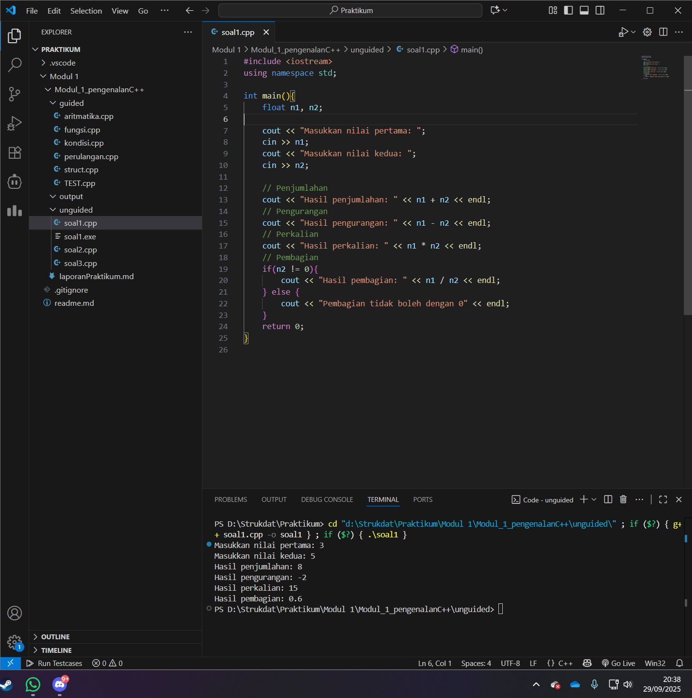
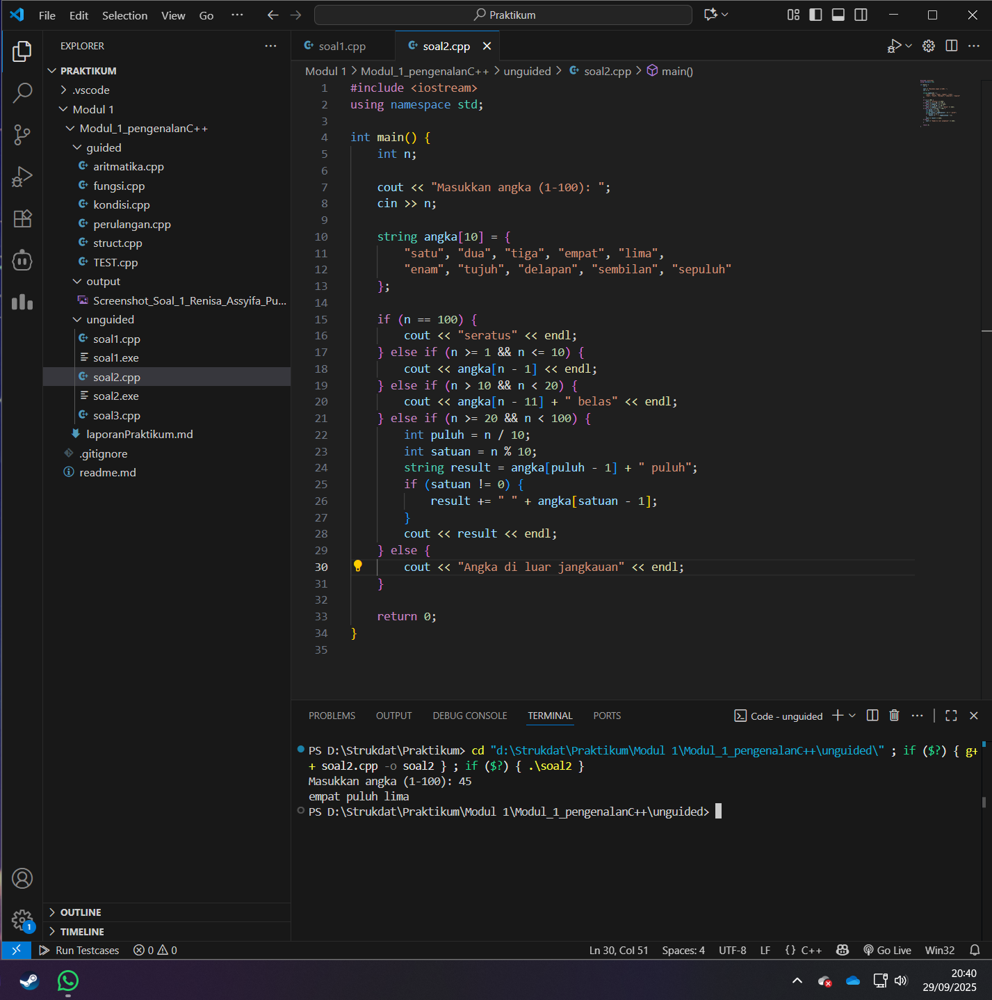
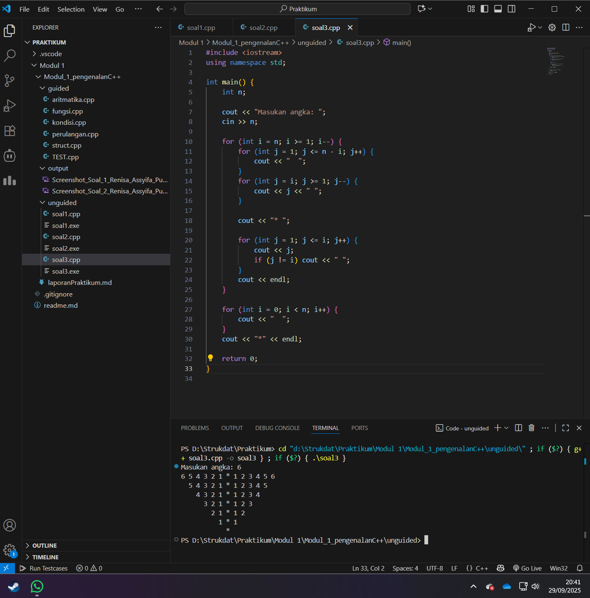

# <h1 align="center">Laporan Praktikum Modul 1 <br> Pengenalan C++</h1>

<p align="center">Renisa Assyifa Putri - 103112400123</p>

## Dasar Teori

Pemrograman adalah sebuah proses untuk membuat serangkaian instruksi yang dapat dimengerti komputer untuk menyelesaikan tugas tertentu secara logis dan terstruktur. Pada C++, konsep fundamental pemrograman mencakup penggunaan variabel untuk penyimpanan data, tipe data yang spesifik (seperti int untuk bilangan bulat, float atau double untuk bilangan desimal, dan string untuk teks), operasi matematika dasar, struktur kontrol alur program, fungsi untuk modularitas, serta tipe data bentukan seperti struct.

Untuk mengatur alur eksekusi program, C++ menyediakan struktur kontrol. Struktur percabangan (if-else, switch-case) berfungsi untuk mengeksekusi blok kode berdasarkan kondisi yang terpenuhi, sementara struktur perulangan (for, while, do-while) digunakan untuk menjalankan blok kode secara berulang. Selain itu, penggunaan fungsi dan prosedur memungkinkan pemrogram untuk memecah masalah kompleks menjadi sub-masalah yang lebih kecil, sehingga kode menjadi lebih rapi, mudah dikelola, dan dapat digunakan kembali (reusable).

C++ juga menawarkan struct, sebuah fitur yang memungkinkan pengelompokan beberapa variabel dengan tipe data yang berbeda ke dalam satu unit. Contohnya adalah data seorang mahasiswa yang dapat terdiri dari nama, NIM, dan IPK yang disatukan dalam satu struct. Untuk berinteraksi dengan pengguna, C++ menggunakan cin sebagai standar input dan cout sebagai standar output, dengan fungsi pendukung seperti getline untuk membaca input berupa baris teks.

Pemahaman konsep-konsep dasar ini menjadi fondasi bagi mahasiswa untuk merancang program-program sederhana, mulai dari kalkulator, konverter angka ke teks, penentu hari, hingga program untuk mencetak pola. Latihan semacam ini sangat penting untuk mengasah kemampuan berpikir komputasional dan logika pemrograman.

## Guided

### Soal 1 Aritmatika

```cpp
#include <iostream>
using namespace std;
int main()
{
    int W, X, Y;
    float Z;
    X = 7;
    Y = 3;
    W = 1;
    Z = (X + Y) / (Y + W);
    cout << "Nilai z = " << Z << endl;
    return 0;
}
```

Program di atas bertujuan untuk melakukan perhitungan matematis sederhana. Nilai Z didapatkan dari hasil pembagian antara (X + Y) dengan (Y + W). Nilai variabel X, Y, dan W telah ditentukan secara hardcode di dalam program. Hasil akhir dari operasi tersebut, yang disimpan dalam variabel Z bertipe float, kemudian dicetak ke layar.

### Soal 2 Fungsi

```cpp
#include <iostream>
using namespace std;

// Prosedur: hanya menampilkan hasil, tidak mengembalikan nilai
void tampilkanHasil(double p, double l)
{
    cout << "\n=== Hasil Perhitungan ===" << endl;
    cout << "Panjang : " << p << endl;
    cout << "Lebar   : " << l << endl;
    cout << "Luas    : " << p * l << endl;
    cout << "Keliling: " << 2 * (p + l) << endl;
}

// Fungsi: mengembalikan nilai luas
double hitungLuas(double p, double l)
{
    return p * l;
}

// Fungsi: mengembalikan nilai keliling
double hitungKeliling(double p, double l)
{
    return 2 * (p + l);
}

int main()
{
    double panjang, lebar;

    cout << "Masukkan panjang: ";
    cin >> panjang;
    cout << "Masukkan lebar  : ";
    cin >> lebar;

    // Panggil fungsi
    double luas = hitungLuas(panjang, lebar);
    double keliling = hitungKeliling(panjang, lebar);

    cout << "\nDihitung dengan fungsi:" << endl;
    cout << "Luas      = " << luas << endl;
    cout << "Keliling  = " << keliling << endl;

    // Panggil prosedur
    tampilkanHasil(panjang, lebar);

    return 0;
}

```

Program ini mendemonstrasikan cara menghitung luas serta keliling dari sebuah persegi panjang. Input berupa nilai panjang dan lebar diterima dari pengguna. Program ini mengimplementasikan dua buah fungsi (hitungLuas dan hitungKeliling) yang masing-masing mengembalikan nilai hasil perhitungan, dan satu prosedur (tampilkanHasil) yang bertugas untuk menampilkan keseluruhan hasil secara langsung tanpa mengembalikan nilai.

### Soal 3 Perkondisian

```cpp
#include <iostream>
using namespace std;
// int main()
// {
//     double tot_pembelian, diskon;
//     cout << "total pembelian: Rp";
//     cin >> tot_pembelian;
//     diskon = 0;
//     if (tot_pembelian >= 100000)
//         diskon = 0.05 * tot_pembelian;
//     cout << "besar diskon = Rp" << diskon;
// }

// int main()
// {
//     double tot_pembelian, diskon;
//     cout << "total pembelian: Rp";
//     cin >> tot_pembelian;
//     diskon = 0;
//     if (tot_pembelian >= 100000)
//         diskon = 0.05 * tot_pembelian;
//     else
//         diskon = 0;
//     cout << "besar diskon = Rp" << diskon;
// }

int main()
{
    int kode_hari;
    cout << "Menentukan hari kerja/libur\n"<<endl;
    cout << "1=Senin 3=Rabu 5=Jumat 7=Minggu "<<endl;
    cout << "2=Selasa 4=Kamis 6=Sabtu "<<endl;
    cin >> kode_hari;
    switch (kode_hari)
    {
    case 1:
        cout<<"Hari Kerja";
        break;
    case 2:
        cout<<"Hari Kerja";
        break;
    case 3:
        cout<<"Hari Kerja";
        break;
    case 4:
        cout<<"Hari Kerja";
        break;
    case 5:
        cout<<"Hari Kerja";
        break;
    case 6:
        cout<<"Hari Libur";
        break;
    case 7:
        cout<<"Hari Libur";
        break;
    default:
        cout<<"Kode masukan salah!!!";
    }
    return 0;
}

```

Kode ini menampilkan implementasi struktur kontrol percabangan. Dua blok kode pertama (yang berada dalam komentar) adalah contoh penggunaan if dan if-else untuk memberikan diskon sebesar 5% jika total belanja mencapai Rp100.000 atau lebih. Blok kode yang aktif adalah program yang meminta pengguna memasukkan kode hari dalam bentuk angka (1-7). Berdasarkan input tersebut, program menggunakan struktur switch-case untuk menentukan dan menampilkan output apakah hari itu tergolong "Hari Kerja" atau "Hari Libur". Jika input di luar rentang 1-7, sebuah pesan kesalahan akan ditampilkan.

### Soal 4 Perulangan

```cpp
#include <iostream>
using namespace std;
// int main()
// {
//     int jum;
//     cout << "jumlah perulangan: ";
//     cin >> jum;
//     for (int i = 0; i < jum; i++)
//     {
//         cout << "saya sahroni\n";
//     }
//     return 1;
// }

// while
int main()
{
    int i = 1;
    int jum;
    cin >> jum;
    do
    {
        cout << "bahlil ke-" << (i + 1) << endl;
        i++;
    } while (i < jum);
    return 0;
}
```

Program ini menunjukkan dua contoh implementasi perulangan. Pada bagian yang dikomentari, sebuah for loop digunakan untuk mencetak teks secara berulang sebanyak jumlah yang diinput oleh pengguna. Sementara itu, pada bagian kode yang aktif, sebuah do-while loop digunakan. Program ini akan mencetak teks "bahlil ke-" diikuti dengan nomor urut yang dimulai dari 2, dan perulangan akan terus berjalan hingga nilai i mencapai jumlah yang ditentukan oleh input pengguna.

### Soal 5 Struct

```cpp
#include <iostream>
#include <string>
using namespace std;

// Definisi struct
struct Mahasiswa {
    string nama;
    string nim;
    float ipk;
};

int main() {

    Mahasiswa mhs1;

    cout << "Masukkan Nama Mahasiswa: ";
    getline(cin, mhs1.nama);
    // cin >> mhs1.nama;
    cout << "Masukkan NIM Mahasiswa : ";
    cin >> mhs1.nim;
    cout << "Masukkan IPK Mahasiswa : ";
    cin >> mhs1.ipk;

    cout << "\n=== Data Mahasiswa ===" << endl;
    cout << "Nama : " << mhs1.nama << endl;
    cout << "NIM  : " << mhs1.nim << endl;
    cout << "IPK  : " << mhs1.ipk << endl;

    return 0;
}

```

Program ini mengilustrasikan penggunaan struct untuk mengelompokkan data yang saling terkait. Sebuah struct dengan nama Mahasiswa didefinisikan untuk menampung tiga data: nama, nim, dan ipk. Program kemudian meminta pengguna untuk memasukkan ketiga data tersebut. Setelah data berhasil diinput, program akan menampilkannya kembali dalam format yang terstruktur.

### Soal 6 Test

```cpp
#include <iostream>
using namespace std;
int main()
{
    string ch;
    cout << "Masukkan sebuah karakter: ";
    // cin >> ch;
    ch = getchar();  //Menggunakan getchar() untuk membaca satu karakter
    cout << "Karakter yang Anda masukkan adalah: " << ch << endl;
    return 0;
}

```

Program ini didesain untuk membaca sebuah karakter tunggal dari input pengguna. Fungsi getchar() digunakan secara spesifik untuk menangkap karakter pertama yang dimasukkan. Selanjutnya, karakter tersebut dicetak kembali ke layar sebagai output.

## Unguided

### Soal 1

Buatlah program yang menerima input-an dua buah bilangan bertipe float, kemudian memberikan output-an hasil penjumlahan, pengurangan, perkalian, dan pembagian dari dua bilangan tersebut.

```cpp
#include <iostream>
using namespace std;

int main(){
    float n1, n2;

    cout << "Masukkan nilai pertama: ";
    cin >> n1;
    cout << "Masukkan nilai kedua: ";
    cin >> n2;

    // Penjumlahan
    cout << "Hasil penjumlahan: " << n1 + n2 << endl;
    // Pengurangan
    cout << "Hasil pengurangan: " << n1 - n2 << endl;
    // Perkalian
    cout << "Hasil perkalian: " << n1 * n2 << endl;
    // Pembagian
    if(n2 != 0){
        cout << "Hasil pembagian: " << n1 / n2 << endl;
    } else {
        cout << "Pembagian tidak boleh dengan 0" << endl;
    }
    return 0;
}

```

> Output
> 

Program C++ di atas berfungsi sebagai kalkulator sederhana yang melakukan empat operasi aritmatika dasar. Program ini meminta pengguna untuk memasukkan dua bilangan desimal (n1 dan n2). Kemudian, program secara berurutan menampilkan hasil dari penjumlahan, pengurangan, perkalian, dan pembagian kedua bilangan tersebut. Terdapat sebuah kondisi khusus untuk operasi pembagian untuk mencegah terjadinya error akibat pembagian dengan nol.

### Soal 2

Buatlah sebuah program yang menerima masukan angka dan mengeluarkan angka tersebut dalam bentuk tulisan. Angka yang diinput user adalah positif mulai dari 0 s.d 100.

```cpp
#include <iostream>
using namespace std;

int main() {
    int n;

    cout << "Masukkan angka (1-100): ";
    cin >> n;

    string angka[10] = {
        "satu", "dua", "tiga", "empat", "lima",
        "enam", "tujuh", "delapan", "sembilan", "sepuluh"
    };

    if (n == 100) {
        cout << "seratus" << endl;
    } else if (n >= 1 && n <= 10) {
        cout << angka[n - 1] << endl;
    } else if (n > 10 && n < 20) {
        cout << angka[n - 11] + " belas" << endl;
    } else if (n >= 20 && n < 100) {
        int puluh = n / 10;
        int satuan = n % 10;
        string result = angka[puluh - 1] + " puluh";
        if (satuan != 0) {
            result += " " + angka[satuan - 1];
        }
        cout << result << endl;
    } else {
        cout << "Angka di luar jangkauan" << endl;
    }

    return 0;
}

```

> Output
> 

Program ini berfungsi sebagai konverter angka menjadi teks dalam Bahasa Indonesia untuk rentang 1 hingga 100. Program ini menggunakan logika percabangan untuk menangani beberapa kasus. Untuk angka 1-10, program mengambil string dari array yang telah didefinisikan. Untuk angka belasan (11-19), program menggabungkan nama satuan dengan akhiran "belas". Untuk angka puluhan (20-99), angka dipecah menjadi puluhan dan satuan untuk dirangkai. Terdapat kasus khusus untuk angka 100, dan sebuah pesan error akan muncul jika angka yang diinput berada di luar jangkauan yang ditentukan.

### Soal 3

Buatlah program yang dapat memberikan input dan output seperti segitiga dengan angka

```cpp
#include <iostream>
using namespace std;

int main() {
    int n;

    cout << "Masukan angka: ";
    cin >> n;

    for (int i = n; i >= 1; i--) {
        for (int j = 1; j <= n - i; j++) {
            cout << "  ";
        }
        for (int j = i; j >= 1; j--) {
            cout << j << " ";
        }

        cout << "* ";

        for (int j = 1; j <= i; j++) {
            cout << j;
            if (j != i) cout << " ";
        }
        cout << endl;S
    }

    for (int i = 0; i < n; i++) {
        cout << "  ";
    }
    cout << "*" << endl;

    return 0;
}

```

> Output
> 

Program ini dirancang untuk menghasilkan sebuah pola piramida angka terbalik yang simetris berdasarkan input n dari pengguna. Program menggunakan perulangan bersarang (nested loop). Loop terluar mengontrol baris, sedangkan loop di dalamnya mengatur pencetakan spasi untuk indentasi, urutan angka menurun di sisi kiri, karakter * di tengah, dan urutan angka menaik di sisi kanan. Setelah pola utama selesai, sebuah baris tambahan yang hanya berisi karakter * di tengah dicetak sebagai penutup.

## Referensi

1. Wijayanto, B. A., & Anistyasari, Y. (2022). E-Modul Pembelajaran Coding Berbasis Pengenalan Budaya Indonesia untuk Meningkatkan Computational Thinking. Jurnal Obsesi: Jurnal Pendidikan Anak Usia Dini, 6(4), 2866–2874. https://obsesi.or.id/index.php/obsesi/article/view/2323

2. Safitri, I. (2022). Pembelajaran Coding di Sekolah Dasar. Jurnal Pendidikan Indonesia (JPI), 3(3), 201–210. https://jpion.org/index.php/jpi/article/view/326

3. Prabowo, A., & Setiawan, A. (2019). Learning Tool for Robotics Basic Programming Based on Contextual Teaching and Learning to Improve Problem-Solving Skills. Jurnal Pendidikan Teknologi dan Kejuruan, 25(2), 159–167. https://jurnal.uny.ac.id/index.php/jptk/article/view/22856
