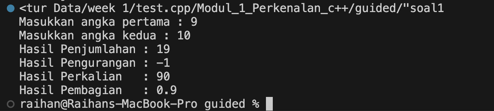
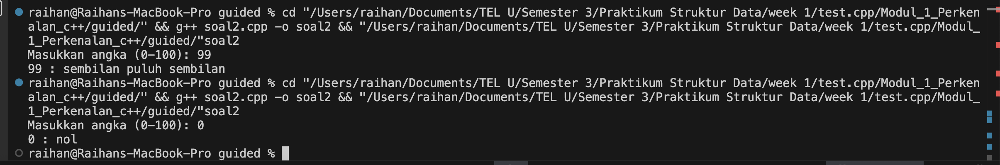
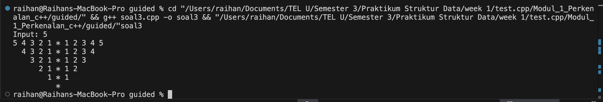

# <h1 align="center">Laporan Praktikum Modul 1 <br> Pengenalan C++</h1>

<p align="center">Raihan Adi Arba - 103112400071</p>

## Dasar Teori

Pemrograman merupakan kegiatan menyusun instruksi secara sistematis agar dapat dipahami dan dijalankan oleh komputer untuk menyelesaikan suatu permasalahan. Bahasa C++ digunakan sebagai salah satu media untuk menuangkan instruksi tersebut dalam bentuk kode yang terstruktur dan logis. Dalam proses pemrograman, pemahaman terhadap konsep dasar sangat diperlukan. Salah satu konsep utama adalah penggunaan variabel dan tipe data. Variabel berfungsi sebagai wadah penyimpanan informasi, sedangkan tipe data menentukan bentuk data yang digunakan, seperti int untuk bilangan bulat, float atau double untuk bilangan desimal, dan string untuk teks.

C++ juga menyediakan berbagai struktur kontrol untuk mengatur alur eksekusi program. Struktur percabangan seperti if-else dan switch memungkinkan program mengambil keputusan berdasarkan kondisi tertentu, sedangkan struktur perulangan seperti for, while, dan do-while memudahkan pelaksanaan proses yang dilakukan secara berulang tanpa harus menulis kode yang sama berulang kali. Untuk mendukung keteraturan program, C++ memanfaatkan fungsi sebagai cara untuk memecah permasalahan besar menjadi bagian-bagian kecil yang lebih mudah dikelola dan dapat digunakan kembali dalam berbagai konteks.

Selain itu, C++ memiliki fitur struct yang digunakan untuk menggabungkan beberapa variabel dengan tipe data berbeda ke dalam satu kesatuan. Misalnya, dalam pengelolaan data penduduk, kita dapat membuat satu struct yang berisi beberapa informasi penting seperti nama (string), NIK (string), umur (int), alamat (string), dan status perkawinan (string). Dengan struct, seluruh data tersebut dapat dikelompokkan dalam satu unit data bernama, misalnya Penduduk. Hal ini memudahkan proses pengolahan data seperti pencatatan, pencarian, dan penampilan informasi tanpa perlu membuat variabel terpisah untuk setiap atribut penduduk.

## Guided

### Soal 1 Aritmatika

```cpp
#include <iostream>
using namespace std;
int main()
{
    int W, X, Y;
    float Z;
    X = 7;
    Y = 3;
    W = 1;
    Z = (X + Y) / (Y + W);
    cout << "Nilai z = " << Z << endl;
    return 0;
}
```

Program ini bertujuan untuk melakukan perhitungan matematika sederhana. Terdapat tiga variabel bertipe int (W, X, Y) dan satu variabel bertipe float (Z). Nilai X, Y, dan W ditetapkan secara langsung: X = 7, Y = 3, dan W = 1. Program kemudian menghitung nilai Z menggunakan rumus ((X + Y) / (Y + W)), yaitu ((7 + 3) / (3 + 1) = 10 / 4 = 2.5). Karena Z bertipe float, hasil pembagian disimpan sebagai bilangan desimal. Terakhir, hasil perhitungan ditampilkan ke layar menggunakan cout.

### Soal 2 Fungsi

```cpp
#include <iostream>
using namespace std;

// Prosedur: hanya menampilkan hasil, tidak mengembalikan nilai
void tampilkanHasil(double p, double l)
{
    cout << "\n=== Hasil Perhitungan ===" << endl;
    cout << "Panjang : " << p << endl;
    cout << "Lebar   : " << l << endl;
    cout << "Luas    : " << p * l << endl;
    cout << "Keliling: " << 2 * (p + l) << endl;
}

// Fungsi: mengembalikan nilai luas
double hitungLuas(double p, double l)
{
    return p * l;
}

// Fungsi: mengembalikan nilai keliling
double hitungKeliling(double p, double l)
{
    return 2 * (p + l);
}

int main()
{
    double panjang, lebar;

    cout << "Masukkan panjang: ";
    cin >> panjang;
    cout << "Masukkan lebar  : ";
    cin >> lebar;

    // Panggil fungsi
    double luas = hitungLuas(panjang, lebar);
    double keliling = hitungKeliling(panjang, lebar);

    cout << "\nDihitung dengan fungsi:" << endl;
    cout << "Luas      = " << luas << endl;
    cout << "Keliling  = " << keliling << endl;

    // Panggil prosedur
    tampilkanHasil(panjang, lebar);

    return 0;
}

```

Program ini menunjukkan salah satu cara penggunaan fungsi dan prosedur dalam C++ untuk menghitung luas dan keliling persegi panjang. Program dimulai dengan meminta input dari pengguna berupa nilai panjang dan lebar. Nilai tersebut kemudian diproses menggunakan dua fungsi: hitungLuas() untuk menghitung luas dengan rumus p × l, dan hitungKeliling() untuk menghitung keliling dengan rumus 2 × (p + l). Kedua fungsi ini mengembalikan nilai hasil perhitungan yang kemudian ditampilkan ke layar.
Selain fungsi, program juga menggunakan sebuah prosedur bernama tampilkanHasil(). Berbeda dengan fungsi, prosedur ini tidak mengembalikan nilai, tetapi langsung mencetak semua hasil perhitungan ke layar, termasuk nilai panjang, lebar, luas, dan keliling. 

### Soal 3 Perkondisian

```cpp
#include <iostream>
using namespace std;
// int main()
// {
//     double tot_pembelian, diskon;
//     cout << "total pembelian: Rp";
//     cin >> tot_pembelian;
//     diskon = 0;
//     if (tot_pembelian >= 100000)
//         diskon = 0.05 * tot_pembelian;
//     cout << "besar diskon = Rp" << diskon;
// }

// int main()
// {
//     double tot_pembelian, diskon;
//     cout << "total pembelian: Rp";
//     cin >> tot_pembelian;
//     diskon = 0;
//     if (tot_pembelian >= 100000)
//         diskon = 0.05 * tot_pembelian;
//     else
//         diskon = 0;
//     cout << "besar diskon = Rp" << diskon;
// }

int main()
{
    int kode_hari;
    cout << "Menentukan hari kerja/libur\n"<<endl;
    cout << "1=Senin 3=Rabu 5=Jumat 7=Minggu "<<endl;
    cout << "2=Selasa 4=Kamis 6=Sabtu "<<endl;
    cin >> kode_hari;
    switch (kode_hari)
    {
    case 1:
        cout<<"Hari Kerja";
        break;
    case 2:
        cout<<"Hari Kerja";
        break;
    case 3:
        cout<<"Hari Kerja";
        break;
    case 4:
        cout<<"Hari Kerja";
        break;
    case 5:
        cout<<"Hari Kerja";
        break;
    case 6:
        cout<<"Hari Libur";
        break;
    case 7:
        cout<<"Hari Libur";
        break;
    default:
        cout<<"Kode masukan salah!!!";
    }
    return 0;
}

```

Kode ini menampilkan implementasi struktur kontrol percabangan. Dua blok kode pertama (yang dikomentari) menunjukkan cara memberikan diskon 5% menggunakan percabangan if dan if-else. Jika total pembelian pengguna bernilai Rp100.000 atau lebih, maka diskon dihitung sebagai 5% dari total pembelian. Jika tidak memenuhi syarat, diskon bernilai nol.
Blok kode yang aktif menggunakan struktur switch-case untuk menentukan apakah suatu hari termasuk hari kerja atau hari libur berdasarkan kode angka 1–7 yang dimasukkan oleh pengguna. Kode 1 sampai 5 (Senin–Jumat) dianggap hari kerja, sedangkan kode 6 dan 7 (Sabtu dan Minggu) dianggap hari libur. Jika pengguna memasukkan angka di luar 1–7, program akan menampilkan pesan kesalahan “Kode masukan salah!!!”.

### Soal 4 Perulangan

```cpp
#include <iostream>
using namespace std;
// int main()
// {
//     int jum;
//     cout << "jumlah perulangan: ";
//     cin >> jum;
//     for (int i = 0; i < jum; i++)
//     {
//         cout << "saya sahroni\n";
//     }
//     return 1;
// }

// while
int main()
{
    int i = 1;
    int jum;
    cin >> jum;
    do
    {
        cout << "bahlil ke-" << (i + 1) << endl;
        i++;
    } while (i < jum);
    return 0;
}
```

Program ini menunjukkan dua contoh implementasi perulangan. Bagian pertama (yang dikomentari) menggunakan perulangan for untuk mencetak teks “saya sahroni” berulang kali sesuai jumlah yang dimasukkan pengguna. Perulangan dimulai dari nilai awal 0 dan akan terus berjalan hingga mencapai jumlah yang ditentukan.
Bagian kedua (yang aktif) menggunakan perulangan do-while. Program meminta input jumlah perulangan, lalu mencetak teks “bahlil ke-” diikuti dengan nomor urut yang dimulai dari 2. Proses ini berlangsung selama kondisi i < jum terpenuhi. Struktur do-while memastikan perintah di dalam blok perulangan dijalankan minimal satu kali sebelum pengecekan kondisi dilakukan.

### Soal 5 Struct

```cpp
#include <iostream>
#include <string>
using namespace std;

// Definisi struct
struct Mahasiswa {
    string nama;
    string nim;
    float ipk;
};

int main() {

    Mahasiswa mhs1;

    cout << "Masukkan Nama Mahasiswa: ";
    getline(cin, mhs1.nama);
    // cin >> mhs1.nama;
    cout << "Masukkan NIM Mahasiswa : ";
    cin >> mhs1.nim;
    cout << "Masukkan IPK Mahasiswa : ";
    cin >> mhs1.ipk;

    cout << "\n=== Data Mahasiswa ===" << endl;
    cout << "Nama : " << mhs1.nama << endl;
    cout << "NIM  : " << mhs1.nim << endl;
    cout << "IPK  : " << mhs1.ipk << endl;

    return 0;
}

```

Program ini mengilustrasikan penggunaan struct untuk mengelompokkan data yang saling terkait. Dalam contoh ini, didefinisikan sebuah struct bernama Mahasiswa yang memiliki tiga anggota data, yaitu nama (string), nim (string), dan ipk (float). Struct ini memungkinkan pengelompokan informasi mahasiswa secara rapi tanpa harus membuat variabel terpisah untuk setiap atribut.
Di dalam fungsi main, dibuat satu variabel bertipe Mahasiswa bernama mhs1. Program kemudian meminta pengguna untuk mengisi nama menggunakan getline agar dapat membaca input berupa satu baris teks, serta mengisi NIM dan IPK menggunakan cin. Setelah seluruh data dimasukkan, program menampilkan kembali informasi mahasiswa tersebut secara terstruktur, dengan menuliskan nama, NIM, dan IPK yang telah diinput.

### Soal 6 Test

```cpp
#include <iostream>
using namespace std;
int main()
{
    string ch;
    cout << "Masukkan sebuah karakter: ";
    // cin >> ch;
    ch = getchar();  //Menggunakan getchar() untuk membaca satu karakter
    cout << "Karakter yang Anda masukkan adalah: " << ch << endl;
    return 0;
}

```

Program ini berfungsi untuk membaca satu karakter input dari pengguna dan menampilkannya kembali ke layar. Variabel ch bertipe string digunakan untuk menyimpan karakter yang dimasukkan. Alih-alih menggunakan cin, program memanfaatkan fungsi getchar() yang secara khusus digunakan untuk mengambil satu karakter pertama dari input pengguna, termasuk spasi atau karakter khusus. Nilai karakter yang dibaca kemudian disimpan ke dalam variabel ch dan ditampilkan kembali melalui cout.

## Unguided

### Soal 1

Buatlah program yang menerima input-an dua buah bilangan bertipe float, kemudian memberikan output-an hasil penjumlahan, pengurangan, perkalian, dan pembagian dari dua bilangan tersebut.

```cpp
#include <iostream>
using namespace std;

float penjumlahan(float x, float y){
    return x + y;
}

float pengurangan(float x, float y){
    return x - y;
}

float perkalian(float x, float y){
    return x * y;
}

float pembagian(float x, float y){
    if (y != 0) {
        return x / y;
    } else {
        cout << "Error: Pembagian dengan 0 tidak diperbolehkan!" << endl;
        return 0; 
    }
}

int main(){
    float a, b;

    cout << "Masukkan angka pertama : ";
    cin >> a;
    cout << "Masukkan angka kedua : ";
    cin >> b;

    cout << "Hasil Penjumlahan : " << penjumlahan(a,b) << endl;
    cout << "Hasil Pengurangan : " << pengurangan(a,b) << endl;
    cout << "Hasil Perkalian   : " << perkalian(a,b) << endl;
    cout << "Hasil Pembagian   : " << pembagian(a,b) << endl;

    return 0;
}
```

> Output
> 

Program kalkulator sederhana yang memiliki empat fungsi terpisah untuk melakukan operasi penjumlahan, pengurangan, perkalian, dan pembagian.
Pengguna diminta untuk memasukkan dua angka. Nilai tersebut kemudian dihitung dengan masing-masing fungsi dan hasilnya ditampilkan ke layar. Pada fungsi pembagian, ada pengecekan agar tidak terjadi pembagian dengan nol — jika angka kedua bernilai nol, program akan menampilkan pesan error.

### Soal 2

Buatlah sebuah program yang menerima masukan angka dan mengeluarkan angka tersebut dalam bentuk tulisan. Angka yang diinput user adalah positif mulai dari 0 s.d 100.

```cpp
#include <iostream>
using namespace std;

string satuan(int x){
    switch (x) {
        case 0: return "nol";
        case 1: return "satu";
        case 2: return "dua";
        case 3: return "tiga";
        case 4: return "empat";
        case 5: return "lima";
        case 6: return "enam";
        case 7: return "tujuh";
        case 8: return "delapan";
        case 9: return "sembilan";
        default: return "";
    }
}

int main(){
    int angka;
    cout << "Masukkan angka (0-100): ";
    cin >> angka;

    if (angka < 0 || angka > 100) {
        cout << "Angka di luar jangkauan!" << endl;
        return 0;
    }

    string hasil;
    if (angka == 0) {
        hasil = "nol";
    } else if (angka == 10) {
        hasil = "sepuluh";
    } else if (angka == 11) {
        hasil = "sebelas";
    } else if (angka >= 12 && angka < 20) {
        hasil = satuan(angka % 10) + " belas";
    } else if (angka >= 20 && angka < 100) {
        int p = angka / 10;
        int s = angka % 10;
        hasil = satuan(p) + " puluh";
        if (s != 0) hasil += " " + string(satuan(s));
    } else if (angka == 100) {
        hasil = "seratus";
    } else { 
        hasil = satuan(angka);
    }

    cout << angka << " : " << hasil << endl;
    return 0;
}

```

> Output
> 

Program ini berfungsi sebagai konverter angka menjadi teks dalam Bahasa Indonesia untuk rentang 1 hingga 100. Program dimulai dengan fungsi satuan() yang bertugas mengubah angka satuan (0–9) menjadi teks seperti “nol”, “satu”, “dua”, dan seterusnya. Setelah itu, pengguna diminta untuk memasukkan sebuah angka. Jika angka yang dimasukkan berada di luar jangkauan, program akan menampilkan pesan kesalahan. Selanjutnya, program memproses angka tersebut dengan logika percabangan: angka khusus seperti 0, 10, 11, dan 100 ditangani secara langsung; angka 12–19 diubah menjadi bentuk “belas”; angka 20–99 dipecah menjadi puluhan dan satuan untuk digabung menjadi teks lengkap; sedangkan angka 1–9 langsung dikonversi melalui fungsi satuan(). Terakhir, program menampilkan hasil konversi angka ke bentuk teks di layar.

### Soal 3

Buatlah program yang dapat memberikan input dan output seperti segitiga dengan angka

```cpp
#include <iostream>
using namespace std;

int main() {
    int n;

    cout << "Input: \n";
    cin >> n;

    for (int i = n; i >= 1; i--) {
        for (int j = 1; j <= n - i; j++) {
            cout << "  ";
        }
        for (int j = i; j >= 1; j--) {
            cout << j << " ";
        }

        cout << "* ";

        for (int j = 1; j <= i; j++) {
            cout << j;
            if (j != i) cout << " ";
        }
        cout << endl;S
    }

    for (int i = 0; i < n; i++) {
        cout << "  ";
    }
    cout << "*" << endl;

    return 0;
}

```

> Output
> 

Program ini dirancang untuk menghasilkan sebuah pola piramida angka terbalik yang simetris berdasarkan input n dari pengguna.  Program meminta sebuah angka n sebagai tinggi pola. Bagian pertama menggunakan perulangan for untuk mencetak deretan angka dari n ke 1 di sisi kiri, kemudian mencetak tanda * di tengah, dan dilanjutkan dengan angka dari 1 ke n di sisi kanan. Setiap baris diawali dengan spasi agar pola membentuk segitiga terbalik yang rapi. Setelah semua baris angka dicetak, program mencetak satu bintang * di bagian paling bawah sebagai penutup pola.

## Referensi

1. J. P. Bansod and R. M. Jalnekar, “**Teaching Programming Language Using C++**,” *International Journal of Advanced Research in Computer and Communication Engineering (IJARCCE)*, vol. 2, no. 10, pp. 4027–4030, 2013.
   [https://ijarcce.com/wp-content/uploads/2013/10/IJARCCE2E-a-jyoti-teaching-programming-language-using-c.pdf](https://ijarcce.com/wp-content/uploads/2013/10/IJARCCE2E-a-jyoti-teaching-programming-language-using-c.pdf)

2. M. S. Memon, A. Chandio, dan S. A. Shah, “**Evaluation of C++ Programming Language in Academia**,” *International Journal of Computer Science and Network Security (IJCSNS)*, vol. 18, no. 5, pp. 131–137, 2018.
   [https://paper.ijcsns.org/07_book/201805/20180518.pdf](https://paper.ijcsns.org/07_book/201805/20180518.pdf)

3. K. M. Deitel dan P. J. Deitel, “**An Overview of the C++ Programming Language**,” *Proceedings of the 1991 Winter Simulation Conference*, 1991, pp. 693–702. IEEE.
   [https://doi.org/10.1109/WSC.1991.185671](https://doi.org/10.1109/WSC.1991.185671)