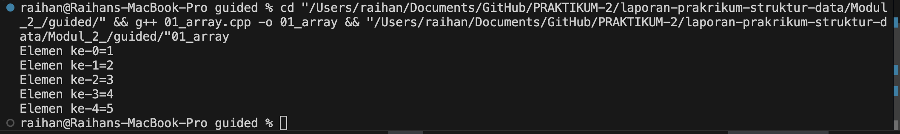
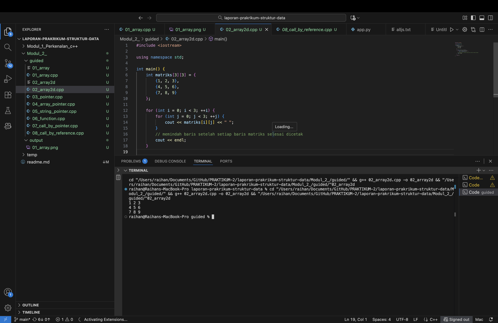
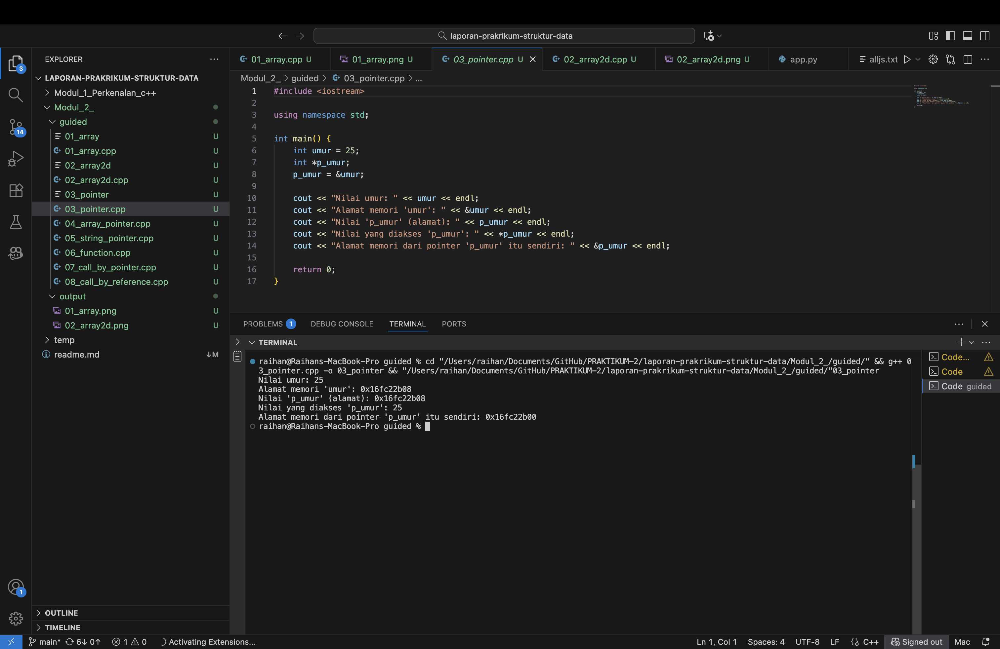
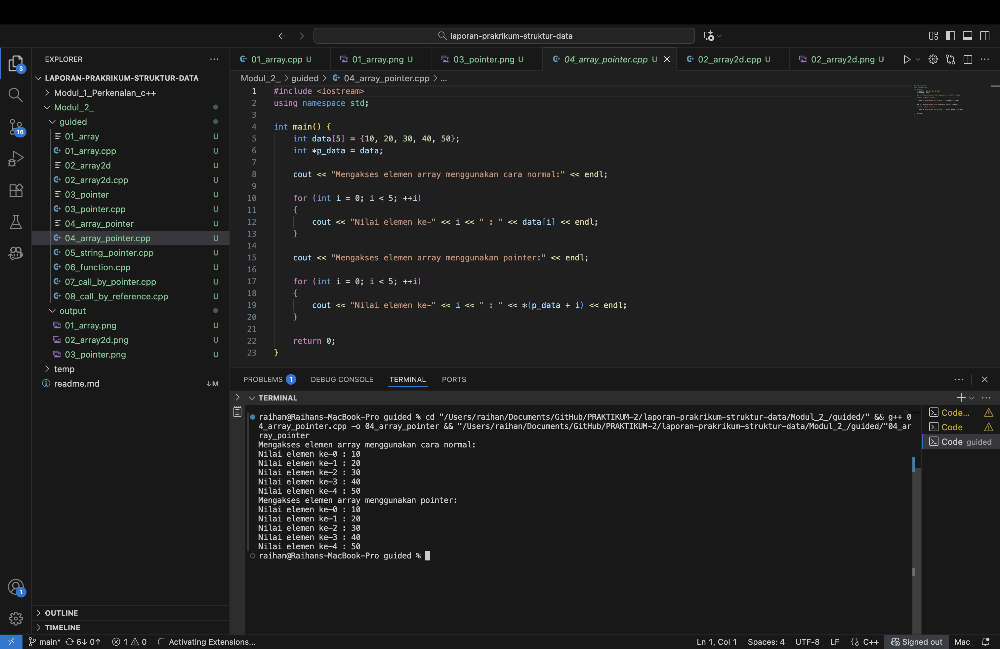
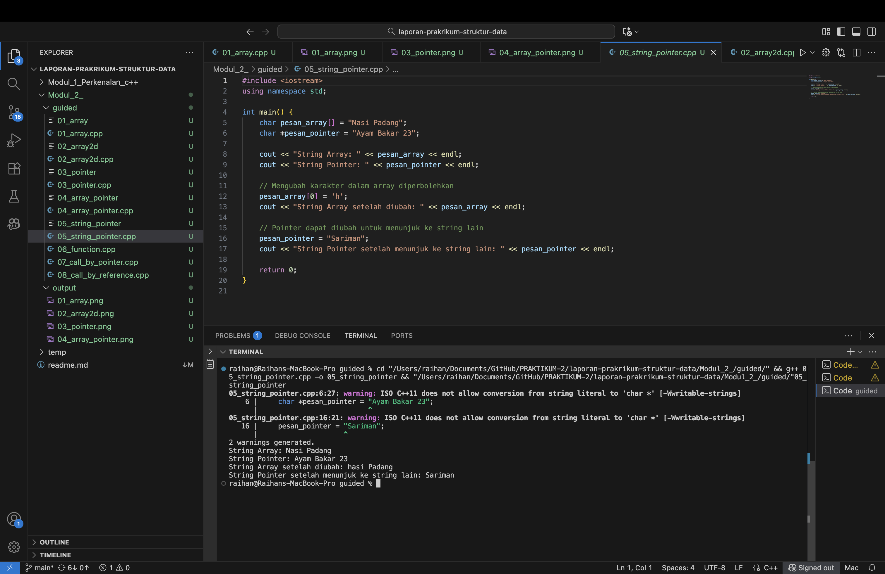
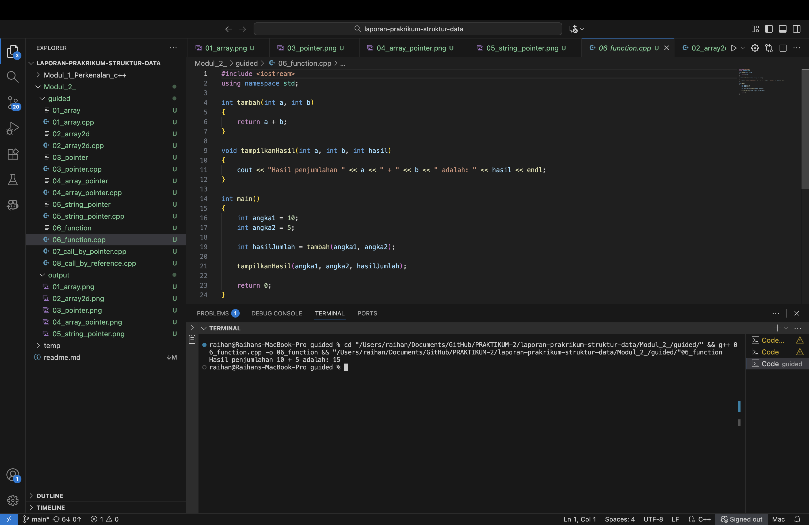
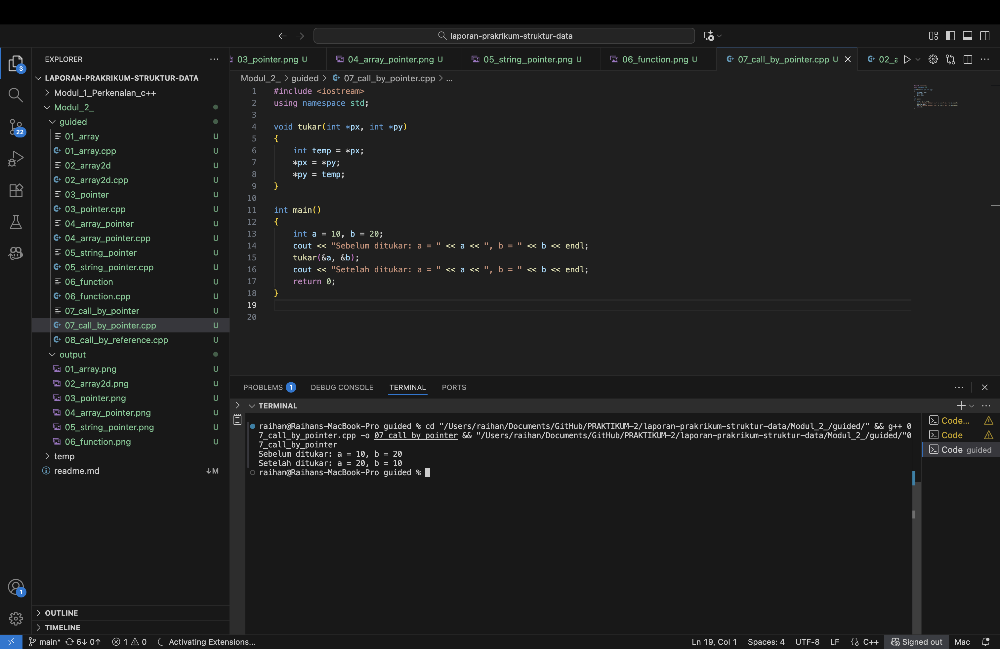
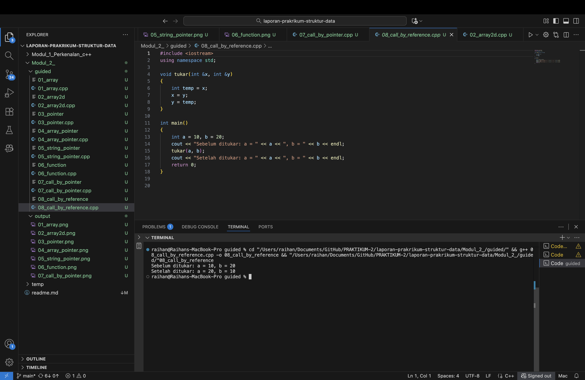
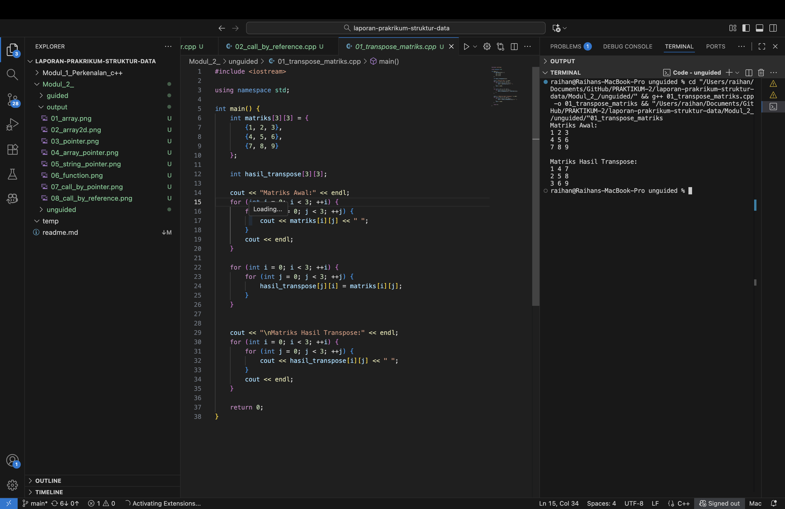
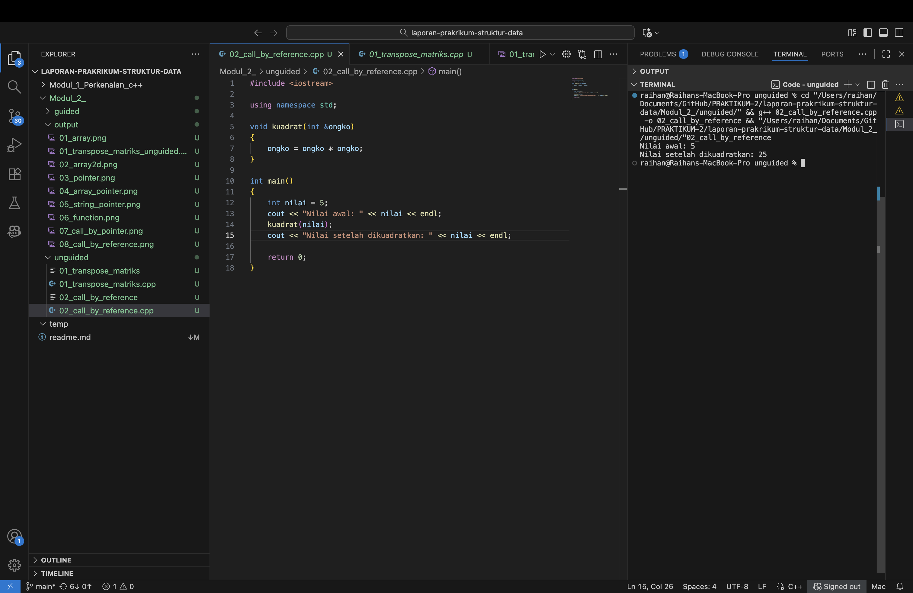

# <h1 align="center">Laporan Praktikum Modul 2 <br> Pengenalan C++ (Bagian Kedua)</h1>

<p align="center">Raihan Adi Arba - 103112400071</p>

## Dasar Teori

Array di C++ adalah struktur data statis yang menempatkan elemen bertipe sama secara kontigu di memori. Keunggulan utamanya terletak pada kemudahan akses berbasis indeks sehingga operasi pembacaan maupun penulisan nilai dapat dilakukan dalam waktu konstan. Ketika array dikembangkan menjadi dua dimensi, susunan elemen berubah menjadi koordinat baris dan kolom sebagaimana matriks. Konstruksi ini sangat penting ketika program menangani transformasi data seperti transpose karena setiap pasangan indeks (i, j) dapat dialihkan secara langsung ke (j, i) tanpa menyalin seluruh isi matriks.

Pointer dan reference memberi kemampuan bagi fungsi untuk memodifikasi data di luar ruang lingkup lokal. Pointer menyimpan alamat memori suatu variabel dan memerlukan dereferensi untuk mengakses nilainya, sedangkan reference (&) berperan sebagai alias yang selalu menunjuk ke variabel asal dengan sintaks yang lebih ringkas. Konsep *call by reference* memanfaatkan salah satu dari dua mekanisme tersebut agar prosedur dapat mengubah nilai variabel pemanggil tanpa mengembalikan data tambahan. Pemahaman terhadap interaksi array, pointer, dan reference menjadi fondasi praktikum modul ini.

## Guided

### Soal 1 Array

```cpp
#include <iostream>
using namespace std;

int main()
{
    int nilai[5] = {1,2,3,4,5};
    for (int i = 0; i < 5; ++i)
    {
        cout << "Elemen ke-" << i << "=" << nilai[i] <<endl;
    }
    return 0;
}
```

> Output  
> 

Program menginisialisasi array berukuran lima elemen dengan nilai tetap. Perulangan for berjalan dari indeks 0 sampai 4 sehingga setiap posisi dilalui secara berurutan. Di dalam perulangan, program mencetak pasangan indeks dan nilai yang tersimpan, menunjukkan bahwa array menyimpan data secara kontigu sehingga akses berbasis indeks berjalan efisien.

### Soal 2 Array Dua Dimensi

```cpp
#include <iostream>

using namespace std;

int main() {
    int matriks[3][3] = {
        {1, 2, 3},
        {4, 5, 6},
        {7, 8, 9}
    };

    for (int i = 0; i < 3; ++i) {
        for (int j = 0; j < 3; ++j) {
            cout << matriks[i][j] << " ";
        }
        // memindah baris setelah setiap baris matriks selesai dicetak
        cout << endl;
    }

    return 0;
}
```

> Output  
> 

Kode mendeklarasikan matriks 3x3 yang sudah terisi nilai. Dua perulangan bersarang digunakan: perulangan luar mengendalikan baris, sedangkan perulangan dalam menelusuri kolom. Setelah satu baris selesai, endl dipanggil untuk memulai baris baru sehingga pola matriks terlihat jelas. Struktur ini menegaskan bagaimana koordinat (i, j) mengakses elemen tertentu pada array dua dimensi.

### Soal 3 Pointer Dasar

```cpp
#include <iostream>

using namespace std;

int main() {
    int umur = 25;
    int *p_umur;
    p_umur = &umur;

    cout << "Nilai umur: " << umur << endl;
    cout << "Alamat memori 'umur': " << &umur << endl;
    cout << "Nilai 'p_umur' (alamat): " << p_umur << endl;
    cout << "Nilai yang diakses 'p_umur': " << *p_umur << endl;
    cout << "Alamat memori dari pointer 'p_umur' itu sendiri: " << &p_umur << endl;

    return 0;
}
```

> Output  
> 

Latihan ini memperlihatkan hubungan antara variabel dan pointer. Variabel umur menyimpan nilai 25, sedangkan p_umur memuat alamat variabel tersebut. Program menampilkan nilai asal, alamat memori variabel, isi pointer, hasil dereferensi, dan alamat pointer itu sendiri. Dengan demikian, pengguna dapat membedakan antara data, alamat tujuan, dan lokasi memori pointer.

### Soal 4 Pointer pada Array

```cpp
#include <iostream>
using namespace std;

int main() {
    int data[5] = {10, 20, 30, 40, 50};
    int *p_data = data; 
    
    cout << "Mengakses elemen array menggunakan cara normal:" << endl;

    for (int i = 0; i < 5; ++i) 
    {
        cout << "Nilai elemen ke-" << i << " : " << data[i] << endl;
    }

    cout << "Mengakses elemen array menggunakan pointer:" << endl;

    for (int i = 0; i < 5; ++i) 
    {
        cout << "Nilai elemen ke-" << i << " : " << *(p_data + i) << endl;
    }

    return 0;
}
```

> Output  
> 

Program ini menunjukkan bahwa array dan pointer dapat dipakai bergantian untuk mengakses elemen. Bagian pertama memakai indeks biasa, sedangkan bagian kedua memanfaatkan pointer p_data yang menunjuk ke elemen pertama. Penambahan i pada pointer menggeser alamat ke elemen berikutnya, dan operator * mengambil nilainya. Kedua metode menghasilkan keluaran identik sehingga konsep identitas antara nama array dan alamat elemen pertama menjadi jelas.

### Soal 5 Pointer String

```cpp
#include <iostream>
using namespace std;

int main() {
    char pesan_array[] = "Nasi Padang";
    char *pesan_pointer = "Ayam Bakar 23";

    cout << "String Array: " << pesan_array << endl;
    cout << "String Pointer: " << pesan_pointer << endl;

    pesan_array[0] = 'h';
    cout << "String Array setelah diubah: " << pesan_array << endl;

    pesan_pointer = "Sariman";
    cout << "String Pointer setelah menunjuk ke string lain: " << pesan_pointer << endl;

    return 0;
}
```

> Output  
> 

Contoh ini menegaskan perbedaan antara string yang disimpan sebagai array karakter dan string literal yang diakses lewat pointer. Elemen pertama pesan_array dapat diganti karena array berada pada memori tulis. Sebaliknya, pointer dialihkan ke literal lain tanpa mengubah isi literal awal. Praktik ini menunjukkan bahwa pointer string lebih fleksibel dalam hal referensi, sedangkan array menawarkan kemampuan mutasi karakter per karakter.

### Soal 6 Fungsi

```cpp
#include <iostream>
using namespace std;

int tambah(int a, int b)
{
    return a + b;
}

void tampilkanHasil(int a, int b, int hasil)
{
    cout << "Hasil penjumlahan " << a << " + " << b << " adalah: " << hasil << endl;
}

int main()
{
    int angka1 = 10;
    int angka2 = 5;

    int hasilJumlah = tambah(angka1, angka2);

    tampilkanHasil(angka1, angka2, hasilJumlah);

    return 0;
}
```

> Output  
> 

Kode memisahkan logika penjumlahan dan logika tampilan ke dua fungsi berbeda. Fungsi tambah menerima dua bilangan dan mengembalikan hasilnya, sedangkan tampilkanHasil bertugas menulis format keluaran ke layar. Dengan desain ini, setiap fungsi memiliki tanggung jawab tunggal sehingga program mudah dirawat dan dapat dikembangkan dengan menambahkan validasi atau operasi lain tanpa mengubah struktur utama.

### Soal 7 Call by Pointer

```cpp
#include <iostream>
using namespace std;

void tukar(int *px, int *py)
{
    int temp = *px;
    *px = *py;
    *py = temp;
}

int main()
{
    int a = 10, b = 20;
    cout << "Sebelum ditukar: a = " << a << ", b = " << b << endl;
    tukar(&a, &b);
    cout << "Setelah ditukar: a = " << a << ", b = " << b << endl;
    return 0;
}
```

> Output  
> 

Fungsi tukar menerima alamat dua variabel melalui pointer. Di dalam fungsi, nilai pada alamat tersebut ditukar menggunakan variabel sementara temp`. Karena pointer memanipulasi data pada alamat asli, perubahan langsung terlihat di variabel a dan b setelah fungsi selesai. Teknik ini umum digunakan pada algoritma yang membutuhkan pertukaran nilai tanpa membuat salinan besar, seperti saat mengurutkan data.

### Soal 8 Call by Reference

```cpp
#include <iostream>
using namespace std;

void tukar(int &x, int &y)
{
    int temp = x;
    x = y;
    y = temp;
}

int main()
{
    int a = 10, b = 20;
    cout << "Sebelum ditukar: a = " << a << ", b = " << b << endl;
    tukar(a, b);
    cout << "Setelah ditukar: a = " << a << ", b = " << b << endl;
    return 0;
}
```

> Output  
> 

Versi reference memiliki alur yang sama dengan fungsi tukar sebelumnya tetapi sintaks pemanggilannya lebih sederhana karena tidak memakai operator & saat memanggil. Parameter x dan y bertindak sebagai alias terhadap variabel a dan b`, sehingga operasi pertukaran dilakukan langsung pada nilai asli. Pendekatan ini membantu menuliskan kode yang lebih bersih sekaligus mempertahankan efisiensi.

## Unguided

### Soal 1 Transpose Matriks 3x3

**Deskripsi Soal**  
Inisialisasi matriks persegi berukuran 3x3 di dalam program, lalu lakukan operasi transpose dengan menukar baris menjadi kolom. Simpan hasil transformasi pada matriks baru dan tampilkan kedua matriks untuk menegaskan perubahan posisi elemen.

```cpp
#include <iostream>

using namespace std;

int main() {
    int matriks[3][3] = {
        {1, 2, 3},
        {4, 5, 6},
        {7, 8, 9}
    };

    int hasil_transpose[3][3];

    cout << "Matriks Awal:" << endl;
    for (int i = 0; i < 3; ++i) {
        for (int j = 0; j < 3; ++j) {
            cout << matriks[i][j] << " ";
        }
        cout << endl;
    }

    for (int i = 0; i < 3; ++i) {
        for (int j = 0; j < 3; ++j) {
            hasil_transpose[j][i] = matriks[i][j];
        }
    }

    cout << "\nMatriks Hasil Transpose:" << endl;
    for (int i = 0; i < 3; ++i) {
        for (int j = 0; j < 3; ++j) {
            cout << hasil_transpose[i][j] << " ";
        }
        cout << endl;
    }

    return 0;
}
```

> Output  
> 

Program dimulai dengan menyiapkan matriks 3x3 yang seluruh elemennya sudah ditentukan. Matriks tersebut dicetak terlebih dahulu agar pola awal terlihat jelas. Proses transpose dilakukan melalui dua perulangan bersarang yang menelusuri setiap pasangan indeks. Ketika berada pada posisi (i, j) di matriks asal, nilai tersebut dipindahkan ke (j, i) pada matriks tujuan. Karena indeks baris dan kolom dipertukarkan, elemen pada diagonal utama tetap berada di tempat yang sama, sementara elemen lain berpindah cermin terhadap diagonal tersebut. Setelah seluruh elemen dipindahkan, matriks hasil dicetak kembali untuk menunjukkan bahwa baris pertama kini menjadi kolom pertama, dan seterusnya. Dengan pendekatan ini, kompleksitas waktu yang dibutuhkan adalah O(n²) terhadap ukuran matriks, sedangkan penggunaan memori tambahan hanya berupa satu matriks baru dengan ukuran sama.

### Soal 2 Call by Reference Mengkuadratkan Nilai

**Deskripsi Soal**  
Buat prosedur kuadratkan yang menerima parameter bertipe integer melalui reference. Prosedur tersebut harus mengubah nilai variabel asli menjadi pangkat duanya. Tampilkan nilai sebelum dan sesudah pemanggilan prosedur pada fungsi main() untuk membuktikan bahwa *call by reference* bekerja.

```cpp
#include <iostream>

using namespace std;

void kuadratkan(int &angka)
{
    angka = angka * angka;
}

int main()
{
    int nilai = 5;
    cout << "Nilai awal: " << nilai << endl;
    kuadratkan(nilai);
    cout << "Nilai setelah dikuadratkan: " << nilai << endl;

    return 0;
}
```

> Output  
> 

Fungsi main() menyiapkan variabel nilai dengan angka 5 lalu mencatat kondisinya sebelum diproses. Prosedur kuadratkan menerima parameter reference sehingga setiap operasi di dalamnya langsung bekerja pada alamat memori variabel asal. Di dalam prosedur, nilai dikalikan dengan dirinya sendiri dan hasilnya disimpan kembali ke parameter yang sama. Karena reference tidak membuat salinan, perubahan segera terlihat ketika program kembali ke main()`. Baris keluaran kedua menunjukkan bahwa nilai telah berubah menjadi 25, menegaskan bahwa mekanisme *call by reference* berhasil melakukan mutasi data tanpa pengembalian nilai eksplisit. Proses ini berlangsung dalam kompleksitas waktu O(1) karena hanya melibatkan satu operasi aritmetika.

## Referensi

1. B. Stroustrup dan P. J. Sutter, “Programming: Principles and Practice Using C++,” Addison-Wesley, 2014. [https://www.stroustrup.com/programming.html](https://www.stroustrup.com/programming.html)  
2. S. B. Lippman, J. Lajoie, dan B. E. Moo, “C++ Primer (5th Edition),” Addison-Wesley, 2013. [https://www.pearson.com/en-us/subject-catalog/p/c-primer/P200000002274/9780321714114](https://www.pearson.com/en-us/subject-catalog/p/c-primer/P200000002274/9780321714114)  
3. “Pointers in C and C++,” GeeksforGeeks, 2023. [https://www.geeksforgeeks.org/pointers-in-c-and-cpp/](https://www.geeksforgeeks.org/pointers-in-c-and-cpp/)
