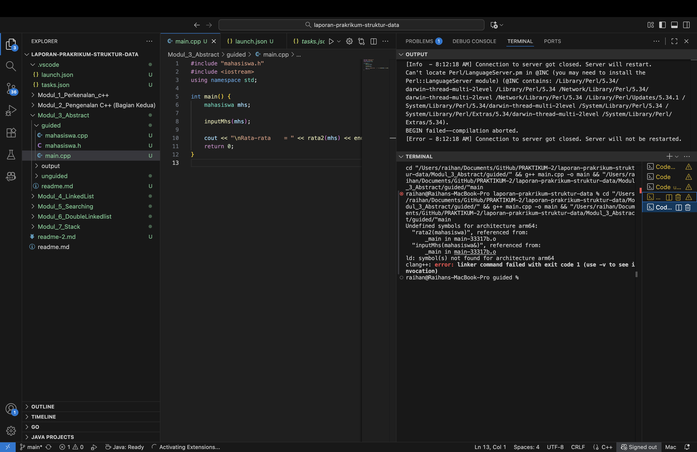
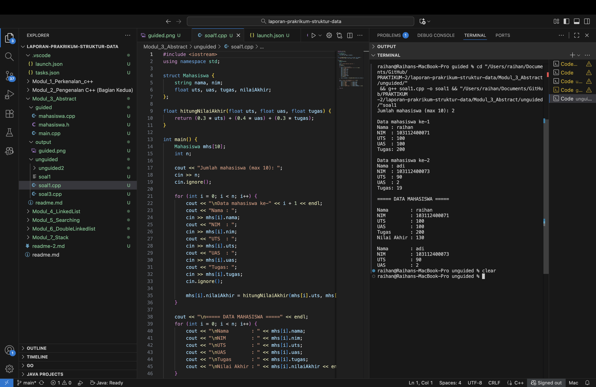
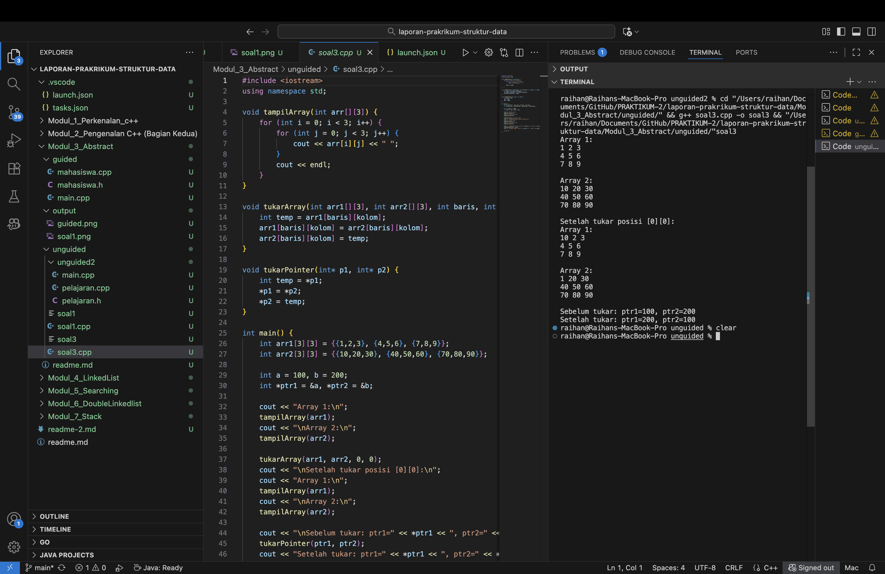

# <h1 align="center">Laporan Praktikum Modul 3 <br>Abstract</h1>

<p align="center">Raihan Adi Arba - 103112400071</p>

## Dasar Teori

Modul 3 membahas Abstract Data Type (ADT), yakni konsep yang memisahkan antara apa yang boleh dilakukan terhadap data (antarmuka) dan bagaimana data itu diimplementasikan. Dengan ADT, cukup memanggil operasi seperti tampil(), tukar(), atau input() tanpa harus mengetahui detail pelaksanaannya.

ADT biasanya direalisasikan lewat struct, class, atau modul, dan menyembunyikan struktur internal (mis. array atau pointer) dari pengguna. Pengguna berinteraksi hanya melalui operasi yang disediakan — prinsip ini dikenal sebagai enkapsulasi: data dan operasi digabungkan, sementara implementasinya tetap tersembunyi agar antarmuka konsisten.

Di mata kuliah Struktur Data, memahami ADT seperti Stack dan Queue penting karena perilakunya tidak bergantung pada implementasi; baik diimplementasikan dengan array maupun linked list, dari sisi pengguna fungsinya tetap sama.

## Guided

### Soal 1 Array

Mahasiswa.h

```cpp
#ifndef MAHASISWA_H_INCLUDE
#define MAHASISWA_H_INCLUDE
struct mahasiswa
{
    char nim[10];
    int nilai1, nilai2;

};
void inputMhs(mahasiswa &m);
float rata2(mahasiswa m);
#endif
```

Mahasiswa.cpp

```cpp
#include "mahasiswa.h"
#include <iostream>
using namespace std;

void inputMhs(mahasiswa &m){
    cout << "input nama = ";
    cin >> (m).nim;
    cout << "input nilai1 = ";
    cin >> (m).nilai1;
    cout << "input niali2 = ";
    cin >> (m).nilai2;
}
float rata2(mahasiswa m) {
    return float(m.nilai1 + m.nilai2) / 2;

}
```

main.cpp

```cpp
#include "mahasiswa.h"
#include <iostream>
using namespace std;

int main(){
    mahasiswa mhs;
    inputMhs(mhs);
    cout << "rata - rata = " << rata2(mhs);
    return 0;
}

```

> 

Program ini menghitung rata‑rata nilai mahasiswa. File mahasiswa.h mendefinisikan tipe data (struct) untuk menyimpan atribut mahasiswa, mahasiswa.cpp menyediakan fungsi untuk memasukkan nama, nilai1, dan nilai2 serta menghitung rata‑rata (jumlah nilai1 dan nilai2 dibagi 2), dan main.cpp memanggil fungsi input lalu menampilkan nilai rata‑rata hasil perhitungan.

## Unguided

### Soal 1

Buat program yang dapat menyimpan data mahasiswa (max. 10) ke dalam sebuah array dengan field nama, NIM, UTS, UAS, tugas, dan nilai akhir. Nilai akhir diperoleh dari fungsi

```cpp
#include <iostream>
using namespace std;

struct Mahasiswa {
    string nama, nim;
    float uts, uas, tugas, nilaiAkhir;
};

float hitungNilaiAkhir(float uts, float uas, float tugas) {
    return (0.3 * uts) + (0.4 * uas) + (0.3 * tugas);
}

int main() {
    Mahasiswa mhs[10];
    int n;

    cout << "Jumlah mahasiswa (max 10): ";
    cin >> n;
    cin.ignore();

    for (int i = 0; i < n; i++) {
        cout << "\nData mahasiswa ke-" << i + 1 << endl;
        cout << "Nama : ";
        cin >> mhs[i].nama;
        cout << "NIM  : ";
        cin >> mhs[i].nim;
        cout << "UTS  : ";
        cin >> mhs[i].uts;
        cout << "UAS  : ";
        cin >> mhs[i].uas;
        cout << "Tugas: ";
        cin >> mhs[i].tugas;
        cin.ignore();

        mhs[i].nilaiAkhir = hitungNilaiAkhir(mhs[i].uts, mhs[i].uas, mhs[i].tugas);
    }

    cout << "\n===== DATA MAHASISWA =====" << endl;
    for (int i = 0; i < n; i++) {
        cout << "\nNama        : " << mhs[i].nama;
        cout << "\nNIM         : " << mhs[i].nim;
        cout << "\nUTS         : " << mhs[i].uts;
        cout << "\nUAS         : " << mhs[i].uas;
        cout << "\nTugas       : " << mhs[i].tugas;
        cout << "\nNilai Akhir : " << mhs[i].nilaiAkhir << endl;
    }

    return 0;
}

```

> Output
> 

Program ini dibuat untuk mengelola data nilai mahasiswa. Sebuah struct bernama Mahasiswa digunakan untuk menyimpan atribut seperti nama, NIM, dan nilai agar data tertata. Fungsi terpisah hitungNilaiAkhir() digunakan untuk menghitung nilai akhir berdasarkan bobot yang ditetapkan. Di dalam main(), program meminta jumlah mahasiswa yang akan diinput lalu melakukan perulangan untuk memasukkan data tiap mahasiswa. Setelah semua data terisi, nilai akhir setiap mahasiswa dihitung menggunakan fungsi tersebut, dan akhirnya seluruh data beserta nilai akhir ditampilkan.

### Soal 2

Buatlah ADT pelajaran sebagai berikut di dalam file “pelajaran.h”

Pelajaran.h

```cpp
#ifndef PELAJARAN_H_INCLUDED
#define PELAJARAN_H_INCLUDED
#include <string>
using namespace std;

struct pelajaran {
    string namaMapel;
    string kodeMapel;
};
pelajaran create_pelajaran(string namaMapel, string kodeMapel);
void tampil_pelajaran(pelajaran pel);

#endif

```

pelajaran.cpp

```cpp

#include <iostream>
#include "pelajaran.h"
using namespace std;

pelajaran create_pelajaran(string namaMapel, string kodeMapel) {
    pelajaran p;
    p.namaMapel = namaMapel;
    p.kodeMapel = kodeMapel;
    return p;
}

void tampil_pelajaran(pelajaran pel) {
    cout << "nama pelajaran : " << pel.namaMapel << endl;
    cout << "nilai          : " << pel.kodeMapel << endl;
}

```

main.cpp

```cpp
#include <iostream>
#include "pelajaran.h"
using namespace std;

int main() {
    string namapel = "Struktur Data";
    string kodepel = "STD";

    pelajaran pel = create_pelajaran(namapel, kodepel);
    tampil_pelajaran(pel);

    return 0;
}
```

> Output
> Dokumentasi keluaran untuk soal ini belum tersedia di folder `output/`.

Program ini memperlihatkan penggunaan Abstract Data Type (ADT) dengan memisahkan kode ke dalam tiga file:

- pelajaran.h (Header): Mendefinisikan struct pelajaran yang menyimpan nama dan kode mata pelajaran serta deklarasi fungsi create_pelajaran() dan prosedur tampil_pelajaran(). File ini berperan sebagai antarmuka/kontrak ADT.

- pelajaran.cpp (Implementasi): Berisi implementasi fungsi-fungsi yang dideklarasikan di header. Fungsi create_pelajaran() membuat objek pelajaran baru, sedangkan tampil_pelajaran() menampilkan data objek tersebut ke layar.

- main.cpp (Driver): Program utama yang memanfaatkan ADT pelajaran. Di sini ditetapkan nama dan kode mata pelajaran, kemudian dipanggil create_pelajaran() untuk membuat objek dan tampil_pelajaran() untuk menampilkannya.

### Soal 3

Buatlah program dengan ketentuan:

- 2 buah array 2D integer berukuran 3x3 dan 2 buah pointer integer
- fungsi/prosedur yang menampilkan isi sebuah array integer 2D
- fungsi/prosedur yang akan menukarkan isi dari 2 array integer 2D pada posisi tertentu
- fungsi/prosedur yang akan menukarkan isi dari variabel yang ditunjuk oleh 2 buah pointer

```cpp
#include <iostream>
using namespace std;

void tampilArray(int arr[][3]) {
    for (int i = 0; i < 3; i++) {
        for (int j = 0; j < 3; j++) {
            cout << arr[i][j] << " ";
        }
        cout << endl;
    }
}

void tukarArray(int arr1[][3], int arr2[][3], int baris, int kolom) {
    int temp = arr1[baris][kolom];
    arr1[baris][kolom] = arr2[baris][kolom];
    arr2[baris][kolom] = temp;
}

void tukarPointer(int* p1, int* p2) {
    int temp = *p1;
    *p1 = *p2;
    *p2 = temp;
}

int main() {
    int arr1[3][3] = {{1,2,3}, {4,5,6}, {7,8,9}};
    int arr2[3][3] = {{10,20,30}, {40,50,60}, {70,80,90}};

    int a = 100, b = 200;
    int *ptr1 = &a, *ptr2 = &b;

    cout << "Array 1:\n";
    tampilArray(arr1);
    cout << "\nArray 2:\n";
    tampilArray(arr2);

    tukarArray(arr1, arr2, 0, 0);
    cout << "\nSetelah tukar posisi [0][0]:\n";
    cout << "Array 1:\n";
    tampilArray(arr1);
    cout << "\nArray 2:\n";
    tampilArray(arr2);

    cout << "\nSebelum tukar: ptr1=" << *ptr1 << ", ptr2=" << *ptr2 << endl;
    tukarPointer(ptr1, ptr2);
    cout << "Setelah tukar: ptr1=" << *ptr1 << ", ptr2=" << *ptr2 << endl;

    return 0;
}
```

> Output
> 

Program ini menukar elemen pada array 2D dan nilai yang ditunjuk oleh dua pointer. Awalnya ditampilkan arr1 (1–9) dan arr2 (10–90). Kemudian elemen pada posisi [0][0] ditukar sehingga arr1[0][0] menjadi 10 dan arr2[0][0] menjadi 1 (elemen lain tetap), lalu nilai yang ditunjuk ptr1 dan ptr2 ditukar sehingga ptr1 berubah dari 100 menjadi 200 dan ptr2 dari 200 menjadi 100.

## Referensi

[1] Instruksi Bahasa Pemrograman ADT (Abstract Data Type) pada Virus dan Loop Batch, Wahyudi, J. (2013). Media Infotama, 9(2). https://www.neliti.com/publications/153187/instruksi-bahasa-pemrograman-adt-abstract-data-type-pada-virus-dan-loop-batch

[2] DT(Abstract Data Type) (Makalah), Rizki Muliono. Dokumen ajar PDF. https://rizkimuliono.blog.uma.ac.id/wp-content/uploads/sites/365/2017/05/ADT-Abstract-Data-Type.pdf

[3] Struktur Data — dokumen RPS Binadarma. Dokumen RPS (2021). https://in.binadarma.ac.id/document/1690340116_RPS%20Struktur%20data%20Terbaru.pdf
