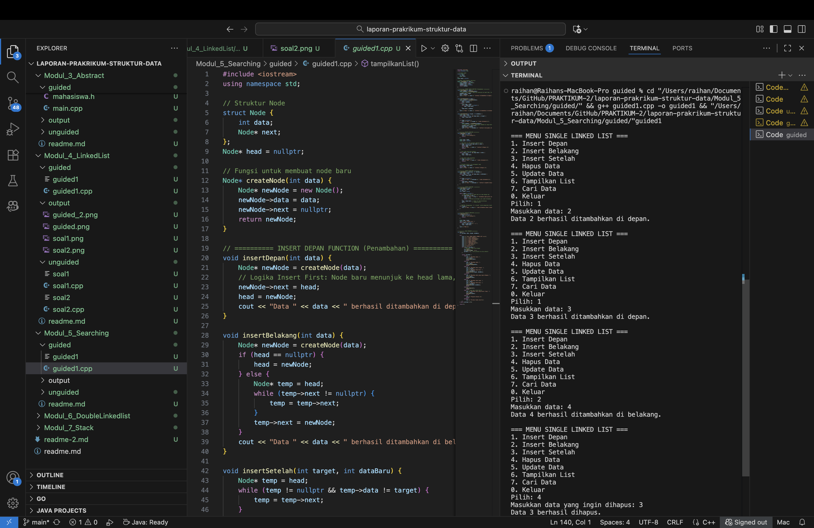
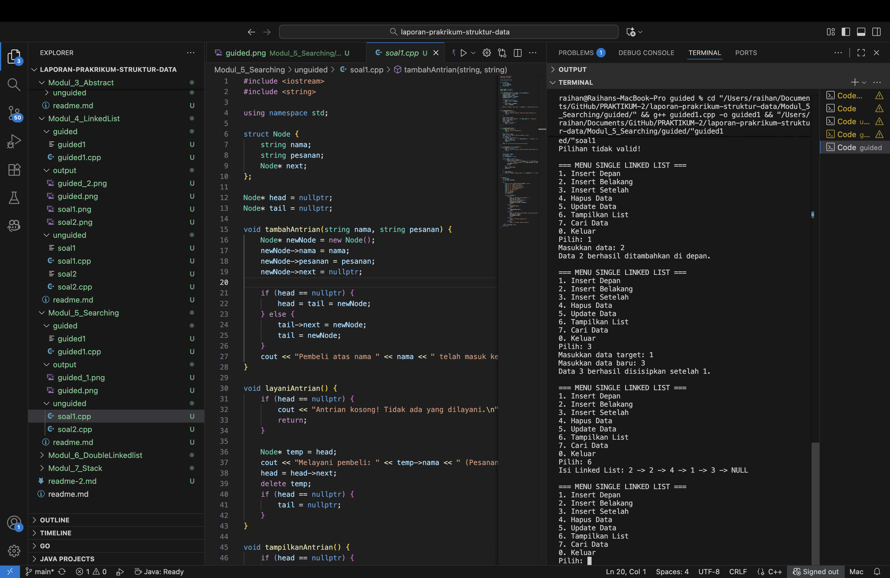
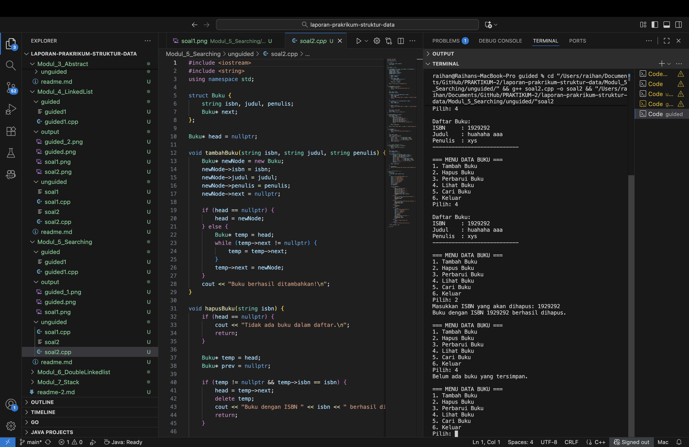

# <h1 align="center">Laporan Praktikum Modul 5 <br>Searching</h1>

<p align="center">Raihan Adi Arba - 103112400071</p>

## Dasar Teori

Pada modul kelima ini fokus pembahasan adalah operasi searching pada singly linked list. Pencarian dilakukan dengan menelusuri node satu per satu mulai dari head melalui pointer next hingga menemukan node yang memiliki nilai yang dicari atau hingga akhir list, sehingga bersifat sekuensial berbeda dengan akses langsung pada array.

Implementasi pencarian umumnya menerima parameter berupa list dan nilai yang dicari, lalu mengembalikan alamat node jika ditemukan atau NULL bila tidak ada. Ada pencarian berdasarkan nilai dan berdasarkan alamat; keduanya bergantung pada pemahaman pointer dan dereferensi, serta menjadi dasar penting untuk operasi lain seperti insert after, delete after, atau update karena operasi tersebut membutuhkan posisi node yang tepat terlebih dahulu.

## Guided

### Soal 1

```cpp
#include <iostream>
using namespace std;

// Struktur Node
struct Node {
    int data;
    Node* next;
};
Node* head = nullptr;

// Fungsi untuk membuat node baru
Node* createNode(int data) {
    Node* newNode = new Node();
    newNode->data = data;
    newNode->next = nullptr;
    return newNode;
}

// ========== INSERT DEPAN FUNCTION (Penambahan) ==========
void insertDepan(int data) {
    Node* newNode = createNode(data);
    // Logika Insert First: Node baru menunjuk ke head lama, lalu head menunjuk ke Node baru.
    newNode->next = head;
    head = newNode;
    cout << "Data " << data << " berhasil ditambahkan di depan.\n";
}

void insertBelakang(int data) {
    Node* newNode = createNode(data);
    if (head == nullptr) {
        head = newNode;
    } else {
        Node* temp = head;
        while (temp->next != nullptr) {
            temp = temp->next;
        }
        temp->next = newNode;
    }
    cout << "Data " << data << " berhasil ditambahkan di belakang.\n";
}

void insertSetelah(int target, int dataBaru) {
    Node* temp = head;
    while (temp != nullptr && temp->data != target) {
        temp = temp->next;
    }

    if (temp == nullptr) {
        cout << "Data " << target << " tidak ditemukan!\n";
    } else {
        Node* newNode = createNode(dataBaru);
        // Logika Insert After: Sambungkan newNode ke temp->next, lalu temp ke newNode
        newNode->next = temp->next;
        temp->next = newNode;
        cout << "Data " << dataBaru << " berhasil disisipkan setelah " << target << ".\n";
    }
}

// ========== DELETE FUNCTION ==========
void hapusNode(int data) {
    if (head == nullptr) {
        cout << "List kosong!\n";
        return;
    }

    Node* temp = head;
    Node* prev = nullptr;

    // Jika data di node pertama (Delete First)
    if (temp != nullptr && temp->data == data) {
        head = temp->next;
        delete temp;
        cout << "Data " << data << " berhasil dihapus.\n";
        return;
    }

    // Cari node yang akan dihapus
    while (temp != nullptr && temp->data != data) {
        prev = temp;
        temp = temp->next;
    }

    // Jika data tidak ditemukan
    if (temp == nullptr) {
        cout << "Data " << data << " tidak ditemukan!\n";
        return;
    }

    // Putuskan tautan: prev melompati temp
    prev->next = temp->next;
    delete temp;
    cout << "Data " << data << " berhasil dihapus.\n";
}

// ========== UPDATE FUNCTION ==========
void updateNode(int dataLama, int dataBaru) {
    Node* temp = head;
    while (temp != nullptr && temp->data != dataLama) {
        temp = temp->next;
    }

    if (temp == nullptr) {
        cout << "Data " << dataLama << " tidak ditemukan!\n";
    } else {
        temp->data = dataBaru;
        cout << "Data " << dataLama << " berhasil diupdate menjadi " << dataBaru << ".\n";
    }
}

// ========== SEARCH FUNCTION  ==========
void searchData(int key) {
    Node *temp = head;
    int pos = 1;
    bool found = false;

    while (temp != nullptr) {
        // Cek apakah data di node saat ini sama dengan key
        if (temp->data == key) {
            cout << "Data " << key << " ditemukan pada posisi ke-" << pos << endl;
            found = true;
            break; // Hentikan perulangan jika sudah ditemukan
        }
        temp = temp->next; // Geser ke node berikutnya
        pos++;             // Tambah posisi
    }

    // PENTING: Menggunakan 'if (!found)' untuk mengoreksi kesalahan logika asli
    if (!found) {
        cout << "Data " << key << " tidak ditemukan dalam linked list.\n";
    }
}


// ========== DISPLAY FUNCTION ==========
void tampilkanList() {
    if (head == nullptr) {
        cout << "List kosong!\n";
        return;
    }

    Node* temp = head;
    cout << "Isi Linked List: ";
    while (temp != nullptr) {
        cout << temp->data << " -> ";
        temp = temp->next;
    }
    cout << "NULL\n";
}


// ========== MAIN PROGRAM ==========
int main() {
    int pilihan, data, target, dataBaru;

    do {
        cout << "\n=== MENU SINGLE LINKED LIST ===\n";
        cout << "1. Insert Depan\n";
        cout << "2. Insert Belakang\n";
        cout << "3. Insert Setelah\n";
        cout << "4. Hapus Data\n";
        cout << "5. Update Data\n";
        cout << "6. Tampilkan List\n";
        cout << "7. Cari Data\n";
        cout << "0. Keluar\n";
        cout << "Pilih: ";
        if (!(cin >> pilihan)) {
            // Menangani input non-integer
            cin.clear();
            cin.ignore(10000, '\n');
            pilihan = -1; // Set pilihan ke nilai default
        }

        switch (pilihan) {
            case 1:
                cout << "Masukkan data: ";
                cin >> data;
                insertDepan(data);
                break;
            case 2:
                cout << "Masukkan data: ";
                cin >> data;
                insertBelakang(data);
                break;
            case 3:
                cout << "Masukkan data target: ";
                cin >> target;
                cout << "Masukkan data baru: ";
                cin >> dataBaru;
                insertSetelah(target, dataBaru);
                break;
            case 4:
                cout << "Masukkan data yang ingin dihapus: ";
                cin >> data;
                hapusNode(data);
                break;
            case 5:
                cout << "Masukkan data lama: ";
                cin >> data;
                cout << "Masukkan data baru: ";
                cin >> dataBaru;
                updateNode(data, dataBaru);
                break;
            case 6:
                tampilkanList();
                break;
            case 7: // Case baru untuk Search
                cout << "Masukkan data yang dicari (key): ";
                cin >> data;
                searchData(data);
                break;
            case 0:
                cout << "Program selesai.\n";
                break;
            default:
                cout << "Pilihan tidak valid!\n";
        }
    } while (pilihan != 0);

    return 0;
}
```

> 

Program ini mengelola data menggunakan singly linked list, di mana setiap elemen disimpan dalam node yang saling terhubung lewat pointer. Struktur Node memuat nilai dan alamat node berikutnya, sedangkan head menunjuk ke node pertama. Tersedia fungsi seperti insertDepan, insertBelakang, dan insertSetelah untuk menambah data pada posisi berbeda, serta hapusNode untuk menghapus dan updateNode untuk mengganti nilai lama dengan yang baru. Perbedaan pada versi ini adalah penambahan fungsi searchData yang mencari nilai dengan menelusuri node dari head secara berurutan; jika ditemukan program menampilkan posisinya, jika tidak akan menampilkan pesan bahwa data tidak ditemukan.

## Unguided

### Soal 1

Buatlah searcing untuk mencari nama pembeli pada unguided sebelumnya

```cpp
#include <iostream>
#include <string>

using namespace std;

struct Node {
    string nama;
    string pesanan;
    Node* next;
};

Node* head = nullptr;
Node* tail = nullptr;

void tambahAntrian(string nama, string pesanan) {
    Node* newNode = new Node();
    newNode->nama = nama;
    newNode->pesanan = pesanan;
    newNode->next = nullptr;

    if (head == nullptr) {
        head = tail = newNode;
    } else {
        tail->next = newNode;
        tail = newNode;
    }
    cout << "Pembeli atas nama " << nama << " telah masuk ke antrian.\n";
}

void layaniAntrian() {
    if (head == nullptr) {
        cout << "Antrian kosong! Tidak ada yang dilayani.\n";
        return;
    }

    Node* temp = head;
    cout << "Melayani pembeli: " << temp->nama << " (Pesanan: " << temp->pesanan << ")\n";
    head = head->next;
    delete temp;
    if (head == nullptr) {
        tail = nullptr;
    }
}

void tampilkanAntrian() {
    if (head == nullptr) {
        cout << "Antrian kosong!\n";
        return;
    }
    Node* temp = head;
    cout << "\n=== Daftar Antrian Pembeli ===\n";
    int nomor = 1;
    while (temp != nullptr) {
        cout << nomor << ". " << temp->nama << " - Pesanan: " << temp->pesanan << endl;
        temp = temp->next;
        nomor++;
    }
    cout << "==============================\n";
}

void cariPembeli(string namaCari) {
    if (head == nullptr) {
        cout << "Antrian kosong! Tidak ada data untuk dicari.\n";
        return;
    }

    Node* temp = head;
    int posisi = 1;
    bool ditemukan = false;

    while (temp != nullptr) {
        if (temp->nama == namaCari) {
            cout << "Pembeli \"" << namaCari << "\" ditemukan di posisi ke-" << posisi
                 << " dengan pesanan: " << temp->pesanan << endl;
            ditemukan = true;
            break;
        }
        temp = temp->next;
        posisi++;
    }

    if (!ditemukan) {
        cout << "Pembeli dengan nama \"" << namaCari << "\" tidak ditemukan dalam antrian.\n";
    }
}

int main() {
    int pilihan;
    string nama, pesanan;

    do {
        cout << "\n=== MENU ANTRIAN PEMBELI ===\n";
        cout << "1. Tambah Antrian\n";
        cout << "2. Layani Antrian\n";
        cout << "3. Tampilkan Antrian\n";
        cout << "4. Cari Pembeli\n";
        cout << "0. Keluar\n";
        cout << "Pilih: ";
        cin >> pilihan;
        cin.ignore();

        switch (pilihan) {
            case 1:
                cout << "Masukkan nama pembeli: ";
                getline(cin, nama);
                cout << "Masukkan pesanan: ";
                getline(cin, pesanan);
                tambahAntrian(nama, pesanan);
                break;
            case 2:
                layaniAntrian();
                break;
            case 3:
                tampilkanAntrian();
                break;
            case 4:
                cout << "Masukkan nama pembeli yang ingin dicari: ";
                getline(cin, nama);
                cariPembeli(nama);
                break;
            case 0:
                cout << "Program selesai.\n";
                break;
            default:
                cout << "Pilihan tidak valid!\n";
        }
    } while (pilihan != 0);
    return 0;
}
```

> Output
> 

Program ini mengimplementasikan sistem antrian pembeli menggunakan single linked list. Setiap Node menyimpan nama pembeli, pesanan, dan penunjuk next yang menghubungkan ke node berikutnya. Pointer head menunjukkan pembeli terdepan, sedangkan tail menunjukkan pembeli terakhir. Fungsi tambahAntrian() menempatkan pembeli di akhir antrian, layaniAntrian() melayani dan menghapus pembeli di depan, dan tampilkanAntrian() menampilkan seluruh daftar antrian. Tambahan fungsi cariPembeli() memungkinkan pencarian pembeli berdasarkan nama beserta posisi dan pesanan jika ditemukan.

### Soal 2

Gunakan latihan pada pertemuan minggun ini dan tambahkan seardhing untuk mencari buku berdasarkan judul, penulis, dan ISBN

```cpp
#include <iostream>
#include <string>
using namespace std;

struct Buku {
    string isbn, judul, penulis;
    Buku* next;
};

Buku* head = nullptr;

void tambahBuku(string isbn, string judul, string penulis) {
    Buku* newNode = new Buku;
    newNode->isbn = isbn;
    newNode->judul = judul;
    newNode->penulis = penulis;
    newNode->next = nullptr;

    if (head == nullptr) {
        head = newNode;
    } else {
        Buku* temp = head;
        while (temp->next != nullptr) {
            temp = temp->next;
        }
        temp->next = newNode;
    }
    cout << "Buku berhasil ditambahkan!\n";
}

void hapusBuku(string isbn) {
    if (head == nullptr) {
        cout << "Tidak ada buku dalam daftar.\n";
        return;
    }

    Buku* temp = head;
    Buku* prev = nullptr;

    if (temp != nullptr && temp->isbn == isbn) {
        head = temp->next;
        delete temp;
        cout << "Buku dengan ISBN " << isbn << " berhasil dihapus.\n";
        return;
    }

    while (temp != nullptr && temp->isbn != isbn) {
        prev = temp;
        temp = temp->next;
    }

    if (temp == nullptr) {
        cout << "Buku dengan ISBN " << isbn << " tidak ditemukan.\n";
        return;
    }

    prev->next = temp->next;
    delete temp;
    cout << "Buku berhasil dihapus.\n";
}

void perbaruiBuku(string isbn) {
    Buku* temp = head;
    while (temp != nullptr) {
        if (temp->isbn == isbn) {
            cout << "Masukkan judul baru: ";
            getline(cin, temp->judul);
            cout << "Masukkan penulis baru: ";
            getline(cin, temp->penulis);
            cout << "Data buku berhasil diperbarui.\n";
            return;
        }
        temp = temp->next;
    }
    cout << "Buku dengan ISBN " << isbn << " tidak ditemukan.\n";
}

void lihatBuku() {
    if (head == nullptr) {
        cout << "Belum ada buku yang tersimpan.\n";
        return;
    }

    Buku* temp = head;
    cout << "\nDaftar Buku:\n";
    while (temp != nullptr) {
        cout << "ISBN     : " << temp->isbn << endl;
        cout << "Judul    : " << temp->judul << endl;
        cout << "Penulis  : " << temp->penulis << endl;
        cout << "---------------------------\n";
        temp = temp->next;
    }
}

// ====== FUNGSI SEARCHING ======
void cariBuku(string key, int pilihan) {
    if (head == nullptr) {
        cout << "Data buku kosong!\n";
        return;
    }

    Buku* temp = head;
    bool ditemukan = false;

    while (temp != nullptr) {
        if ((pilihan == 1 && temp->judul == key) ||
            (pilihan == 2 && temp->penulis == key) ||
            (pilihan == 3 && temp->isbn == key)) {
            cout << "\nBuku ditemukan!\n";
            cout << "ISBN     : " << temp->isbn << endl;
            cout << "Judul    : " << temp->judul << endl;
            cout << "Penulis  : " << temp->penulis << endl;
            cout << "---------------------------\n";
            ditemukan = true;
        }
        temp = temp->next;
    }

    if (!ditemukan) {
        cout << "Buku dengan data tersebut tidak ditemukan.\n";
    }
}

// ====== PROGRAM UTAMA ======
int main() {
    int pilihan;
    string isbn, judul, penulis, key;

    do {
        cout << "\n=== MENU DATA BUKU ===\n";
        cout << "1. Tambah Buku\n";
        cout << "2. Hapus Buku\n";
        cout << "3. Perbarui Buku\n";
        cout << "4. Lihat Buku\n";
        cout << "5. Cari Buku\n";
        cout << "6. Keluar\n";
        cout << "Pilih: ";
        cin >> pilihan;
        cin.ignore();

        switch (pilihan) {
            case 1:
                cout << "Masukkan ISBN: ";
                getline(cin, isbn);
                cout << "Masukkan Judul: ";
                getline(cin, judul);
                cout << "Masukkan Penulis: ";
                getline(cin, penulis);
                tambahBuku(isbn, judul, penulis);
                break;
            case 2:
                cout << "Masukkan ISBN yang akan dihapus: ";
                getline(cin, isbn);
                hapusBuku(isbn);
                break;
            case 3:
                cout << "Masukkan ISBN yang akan diperbarui: ";
                getline(cin, isbn);
                perbaruiBuku(isbn);
                break;
            case 4:
                lihatBuku();
                break;
            case 5:
                int opsi;
                cout << "\nCari berdasarkan:\n";
                cout << "1. Judul\n";
                cout << "2. Penulis\n";
                cout << "3. ISBN\n";
                cout << "Pilih: ";
                cin >> opsi;
                cin.ignore();
                cout << "Masukkan kata kunci: ";
                getline(cin, key);
                cariBuku(key, opsi);
                break;
            case 6:
                cout << "Program selesai.\n";
                break;
            default:
                cout << "Pilihan tidak valid.\n";
        }
    } while (pilihan != 6);

    return 0;
}
```

> Output
> 

Program diatas digunakan untuk mengelola data buku menggunakan Single Linked List. Setiap node menyimpan ISBN, judul, dan penulis. Program menyediakan fitur untuk menambah, menghapus, memperbarui, menampilkan, dan mencari buku. Bagian pencarian (searching) ditambahkan dengan fungsi cariBuku(), yang memungkinkan pengguna mencari buku berdasarkan judul, penulis, atau ISBN. Program akan menelusuri setiap node dari awal (head) hingga menemukan data yang sesuai, lalu menampilkan detail buku tersebut.

## Referensi

[1] Modul 6 Single & Double Linked List, Universitas Negeri Malang. Modul Struktur Data (PDF) https://elektro.um.ac.id/wp-content/uploads/2016/04/ASD-Modul-6-Linked-List.pdf

[2] Linked List, Modul Kuliah Struktur Data Universitas Esa Unggul. https://lms-paralel.esaunggul.ac.id/pluginfile.php?file=%2F86227%2Fmod_resource%2Fcontent%2F1%2FModul+Struktur+Data-Linked+List.pdf

[3] “Struktur Data: Pengertian dan Implementasi Dasar Linked List”, Rumah Coding. https://rumahcoding.co.id/linked-list-pengertian-dan-implementasi-dasar/
