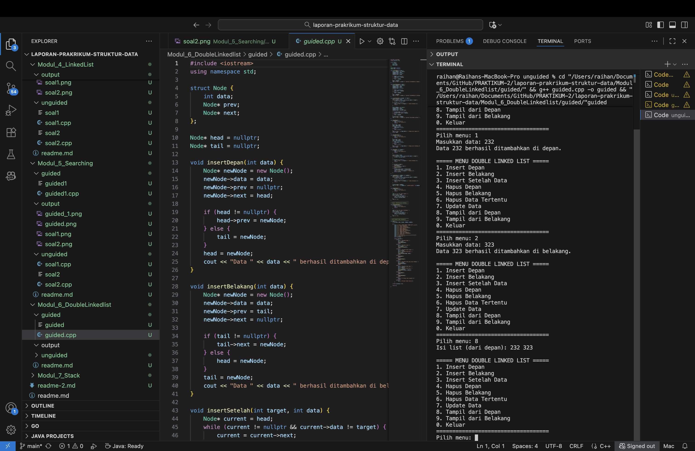

# <h1 align="center">Laporan Praktikum Modul 6 <br>Double Linkedlist</h1>

<p align="center">Raihan Adi Arba - 103112400071</p>

## Dasar Teori

Doubly Linked List adalah perluasan dari Single Linked List di mana setiap node memiliki dua penunjuk (prev dan next), sehingga memungkinkan penelusuran dari kedua arah. Struktur ini memudahkan penyisipan dan penghapusan di tengah daftar tanpa perlu menelusuri dari awal, sehingga sering digunakan pada sistem yang membutuhkan navigasi dua arah (mis. fitur undo/redo atau pengelolaan data). Namun, implementasinya membutuhkan memori lebih dan pengelolaan yang lebih rumit dibandingkan Single Linked List.

## Guided

### Soal 1

```cpp
#include <iostream>
using namespace std;

struct Node {
    int data;
    Node* prev;
    Node* next;
};

Node* head = nullptr;
Node* tail = nullptr;

void insertDepan(int data) {
    Node* newNode = new Node();
    newNode->data = data;
    newNode->prev = nullptr;
    newNode->next = head;

    if (head != nullptr) {
        head->prev = newNode;
    } else {
        tail = newNode;
    }
    head = newNode;
    cout << "Data " << data << " berhasil ditambahkan di depan.\n";
}

void insertBelakang(int data) {
    Node* newNode = new Node();
    newNode->data = data;
    newNode->prev = tail;
    newNode->next = nullptr;

    if (tail != nullptr) {
        tail->next = newNode;
    } else {
        head = newNode;
    }
    tail = newNode;
    cout << "Data " << data << " berhasil ditambahkan di belakang.\n";
}

void insertSetelah(int target, int data) {
    Node* current = head;
    while (current != nullptr && current->data != target) {
        current = current->next;
    }
    if (current == nullptr) {
        cout << "Data " << target << " tidak ditemukan.\n";
        return;
    }

    Node* newNode = new Node();
    newNode->data = data;
    newNode->prev = current;
    newNode->next = current->next;

    if (current->next != nullptr) {
        current->next->prev = newNode;
    } else {
        tail = newNode;
    }
    current->next = newNode;
    cout << "Data " << data << " berhasil disisipkan setelah " << target << ".\n";
}

void hapusDepan() {
    if (head == nullptr) {
        cout << "List kosong.\n";
        return;
    }
    Node* temp = head;
    head = head->next;
    if (head != nullptr) {
        head->prev = nullptr;
    } else {
        tail = nullptr;
    }
    cout << "Data " << temp->data << " dihapus dari depan.\n";
    delete temp;
}

void hapusBelakang() {
    if (tail == nullptr) {
        cout << "List kosong.\n";
        return;
    }
    Node* temp = tail;
    tail = tail->prev;
    if (tail != nullptr) {
        tail->next = nullptr;
    } else {
        head = nullptr;
    }
    cout << "Data " << temp->data << " dihapus dari belakang.\n";
    delete temp;
}

void hapusData (int target) {
    if (head == nullptr) {
        cout << "List kosong.\n";
        return;
    }

    Node* current = head;
    while (current != nullptr && current->data != target) {
        current = current->next;
    }

    if (current == nullptr) {
        cout << "Data " << target << " tidak ditemukan.\n";
        return;
    }

    if (current == head) {
        hapusDepan();
    } else if (current == tail) {
        hapusBelakang();
    } else {
        current->prev->next = current->next;
        current->next->prev = current->prev;
        cout << "Data " << target << " dihapus.\n";
        delete current;
    }
}

void updateData(int oldData, int newData) {
    Node* current = head;
    while (current != nullptr && current->data != oldData)
        current = current->next;

    if (current == nullptr) {
        cout << "Data " << oldData << " tidak ditemukan.\n";
        return;
    }

    current->data = newData;
    cout << "Data " << oldData << " diubah menjadi " << newData << ".\n";
}

void tampilDepan() {
    if (head == nullptr) {
        cout << "List kosong.\n";
        return;
    }

    cout << "Isi list (dari depan): ";
    Node* current = head;
    while (current != nullptr) {
        cout << current->data << " ";
        current = current->next;
    }
    cout << "\n";
}

// ====================================
// Fungsi: Tampilkan dari belakang
// ====================================
void tampilBelakang() {
    if (tail == nullptr) {
        cout << "List kosong.\n";
        return;
    }

    cout << "Isi list (dari belakang): ";
    Node* current = tail;
    while (current != nullptr) {
        cout << current->data << " ";
        current = current->prev;
    }
    cout << "\n";
}

// ====================================
// MAIN PROGRAM (MENU INTERAKTIF)
// ====================================
int main() {
    int pilihan, data, target, oldData, newData;

    do {
        cout << "\n===== MENU DOUBLE LINKED LIST =====\n";
        cout << "1. Insert Depan\n";
        cout << "2. Insert Belakang\n";
        cout << "3. Insert Setelah Data\n";
        cout << "4. Hapus Depan\n";
        cout << "5. Hapus Belakang\n";
        cout << "6. Hapus Data Tertentu\n";
        cout << "7. Update Data\n";
        cout << "8. Tampil dari Depan\n";
        cout << "9. Tampil dari Belakang\n";
        cout << "0. Keluar\n";
        cout << "===================================\n";
        cout << "Pilih menu: ";
        cin >> pilihan;

        switch (pilihan) {
            case 1:
                cout << "Masukkan data: ";
                cin >> data;
                insertDepan(data);
                break;
            case 2:
                cout << "Masukkan data: ";
                cin >> data;
                insertBelakang(data);
                break;
            case 3:
                cout << "Masukkan data target: ";
                cin >> target;
                cout << "Masukkan data baru: ";
                cin >> data;
                insertSetelah(target, data);
                break;
            case 4:
                hapusDepan();
                break;
            case 5:
                hapusBelakang();
                break;
            case 6:
                cout << "Masukkan data yang ingin dihapus: ";
                cin >> target;
                hapusData(target);
                break;
            case 7:
                cout << "Masukkan data lama: ";
                cin >> oldData;
                cout << "Masukkan data baru: ";
                cin >> newData;
                updateData(oldData, newData);
                break;
            case 8:
                tampilDepan();
                break;
            case 9:
                tampilBelakang();
                break;
            case 0:
                cout << "👋 Keluar dari program.\n";
                break;
            default:
                cout << "Pilihan tidak valid.\n";
        }

    } while (pilihan != 0);

    return 0;
}
```

> 
>
> 
>
> Dokumentasi untuk guided 3 belum tersedia di folder `output/`.

Program ini memanfaatkan doubly linked list untuk menyimpan dan memanipulasi data. Lewat menu interaktif, pengguna dapat menambah, menghapus, menampilkan, atau memperbarui node. Setiap node memiliki penunjuk prev dan next sehingga daftar dapat dilintasi dua arah. Penambahan membuat node baru yang bisa ditempatkan di depan, di belakang, atau setelah node tertentu; penghapusan menemukan node target lalu memutus dan merakit ulang tautan antar node agar struktur tetap konsisten. Opsi tampil depan dan tampil belakang menampilkan isi daftar dari kedua arah, sedangkan fitur update mengganti nilai lama dengan nilai baru. Program berjalan terus sampai pengguna memilih keluar.

## Unguided

### Soal 1

Buatlah ADT Doubly Linked list sebagai berikut di dalam file “Doublylist.h”

```
Type infotype : kendaraan <
 nopol : string
 warna : string
 thnBuat : integer
>
Type address : pointer to ElmList
Type ElmList <
 info : infotype
 next :address
 prev : address
>
Type List <
 First : address
 Last : address
>
procedure CreateList( input/output L : List )
function alokasi( x : infotype ) → address
procedure dealokasi(input/output P : address )
procedure printInfo( input L : List )
procedure insertLast(input/output L : List,
 input P : address )

```

Buatlah implementasi ADT Doubly Linked list pada file “Doublylist.cpp” dan coba hasil implementasi ADT pada file “main.cpp”.

```cpp
Masukkan nomor polisi: D001
Masukkan warna kendaraan: hitam
Masukkan tahun kendaraan: 90

Masukkan nomor polisi: D003
Masukkan warna kendaraan: putih
Masukkan tahun kendaraan: 70

Masukkan nomor polisi: D001
Masukkan warna kendaraan: merah
Masukkan tahun kendaraan: 80
Nomor polisi sudah terdaftar

Masukkan nomor polisi: D004
Masukkan warna kendaraan: kuning
Masukkan tahun kendaraan: 90
```

```
No Polisi : D004
Warna     : kuning
Tahun     : 90

No Polisi : D003
Warna     : putih
Tahun     : 70

No Polisi : D001
Warna     : hitam
Tahun     : 90
```

1. doublylist.cpp

```cpp
#include "doublylist.h"

void buatListKosong(List &daftarKendaraan) {
    daftarKendaraan.first = nullptr;
    daftarKendaraan.last = nullptr;
}

Address buatNodeBaru(InfoKendaraan kendaraanBaru) {
    Address node = new Node;
    node->data = kendaraanBaru;
    node->next = nullptr;
    node->prev = nullptr;
    return node;
}

void hapusNode(Address node) {
    delete node;
}

void tambahKendaraanDiAkhir(List &daftarKendaraan, Address nodeBaru) {
    if (daftarKendaraan.first == nullptr) {
        daftarKendaraan.first = nodeBaru;
        daftarKendaraan.last = nodeBaru;
    } else {
        daftarKendaraan.last->next = nodeBaru;
        nodeBaru->prev = daftarKendaraan.last;
        daftarKendaraan.last = nodeBaru;
    }
}

void tampilkanKendaraan(List daftarKendaraan) {
    Address node = daftarKendaraan.first;
    cout << "\nDATA LIST 1\n";
    while (node != nullptr) {
        cout << "Nomor Polisi : " << node->data.nomorPolisi << endl;
        cout << "Warna        : " << node->data.warna << endl;
        cout << "Tahun        : " << node->data.tahun << endl << endl;
        node = node->next;
    }
}

Address cariKendaraan(List daftarKendaraan, string nomorPolisi) {
    Address node = daftarKendaraan.first;
    while (node != nullptr) {
        if (node->data.nomorPolisi == nomorPolisi) {
            return node;
        }
        node = node->next;
    }
    return nullptr;
}

void hapusKendaraanPertama(List &daftarKendaraan, Address &node) {
    if (daftarKendaraan.first != nullptr) {
        node = daftarKendaraan.first;
        if (daftarKendaraan.first == daftarKendaraan.last) {
            daftarKendaraan.first = nullptr;
            daftarKendaraan.last = nullptr;
        } else {
            daftarKendaraan.first = daftarKendaraan.first->next;
            daftarKendaraan.first->prev = nullptr;
            node->next = nullptr;
        }
    }
}

void hapusKendaraanTerakhir(List &daftarKendaraan, Address &node) {
    if (daftarKendaraan.last != nullptr) {
        node = daftarKendaraan.last;
        if (daftarKendaraan.first == daftarKendaraan.last) {
            daftarKendaraan.first = nullptr;
            daftarKendaraan.last = nullptr;
        } else {
            daftarKendaraan.last = daftarKendaraan.last->prev;
            daftarKendaraan.last->next = nullptr;
            node->prev = nullptr;
        }
    }
}

void hapusKendaraanSetelah(Address sebelum, Address &node) {
    if (sebelum != nullptr && sebelum->next != nullptr) {
        node = sebelum->next;
        sebelum->next = node->next;
        if (node->next != nullptr) {
            node->next->prev = sebelum;
        }
        node->next = nullptr;
        node->prev = nullptr;
    }
}
```

2. doubllylist.h

```cpp
#ifndef DOUBLYLIST_H
#define DOUBLYLIST_H

#include <iostream>
#include <string>
using namespace std;

struct Kendaraan {
    string nomorPolisi;
    string warna;
    int tahun;
};

typedef Kendaraan InfoKendaraan;

struct Node {
    InfoKendaraan data;
    Node* next;
    Node* prev;
};

typedef Node* Address;

struct List {
    Address first;
    Address last;
};

void buatListKosong(List &daftarKendaraan);
Address buatNodeBaru(InfoKendaraan kendaraanBaru);
void hapusNode(Address node);
void tambahKendaraanDiAkhir(List &daftarKendaraan, Address nodeBaru);
void tampilkanKendaraan(List daftarKendaraan);
Address cariKendaraan(List daftarKendaraan, string nomorPolisi);
void hapusKendaraanPertama(List &daftarKendaraan, Address &node);
void hapusKendaraanTerakhir(List &daftarKendaraan, Address &node);
void hapusKendaraanSetelah(Address sebelum, Address &node);

#endif
```

3. main.cpp

```cpp
#include "doublylist.h"

bool cekDuplikat(List daftarKendaraan, string nomorPolisi) {
    Address node = daftarKendaraan.first;
    while (node != nullptr) {
        if (node->data.nomorPolisi == nomorPolisi) {
            return true;
        }
        node = node->next;
    }
    return false;
}

int main() {
    List daftarKendaraan;
    buatListKosong(daftarKendaraan);

    int jumlah;
    cout << "Masukkan jumlah data kendaraan: ";
    cin >> jumlah;
    cout << endl;

    for (int i = 0; i < jumlah; i++) {
        InfoKendaraan kendaraanBaru;

        cout << "Masukkan nomor polisi: ";
        cin >> kendaraanBaru.nomorPolisi;

        if (cekDuplikat(daftarKendaraan, kendaraanBaru.nomorPolisi)) {
            cout << "Nomor polisi sudah terdaftar\n\n";
            i--;
            continue;
        }

        cout << "Masukkan warna kendaraan: ";
        cin >> kendaraanBaru.warna;
        cout << "Masukkan tahun kendaraan: ";
        cin >> kendaraanBaru.tahun;
        cout << endl;

        Address nodeBaru = buatNodeBaru(kendaraanBaru);
        tambahKendaraanDiAkhir(daftarKendaraan, nodeBaru);
    }

    tampilkanKendaraan(daftarKendaraan);

    string nomorDicari;
    cout << "Masukkan Nomor Polisi yang dicari : ";
    cin >> nomorDicari;

    Address ditemukan = cariKendaraan(daftarKendaraan, nomorDicari);
    if (ditemukan != nullptr) {
        cout << "\nNomor Polisi : " << ditemukan->data.nomorPolisi << endl;
        cout << "Warna        : " << ditemukan->data.warna << endl;
        cout << "Tahun        : " << ditemukan->data.tahun << endl;
    } else {
        cout << "Data tidak ditemukan.\n";
    }

    string nomorDihapus;
    cout << "\nMasukkan Nomor Polisi yang akan dihapus : ";
    cin >> nomorDihapus;

    Address nodeDihapus = cariKendaraan(daftarKendaraan, nomorDihapus);
    if (nodeDihapus != nullptr) {
        if (nodeDihapus == daftarKendaraan.first) {
            hapusKendaraanPertama(daftarKendaraan, nodeDihapus);
        } else if (nodeDihapus == daftarKendaraan.last) {
            hapusKendaraanTerakhir(daftarKendaraan, nodeDihapus);
        } else {
            hapusKendaraanSetelah(nodeDihapus->prev, nodeDihapus);
        }
        hapusNode(nodeDihapus);
        cout << "Data dengan nomor polisi " << nomorDihapus << " berhasil dihapus.\n";
    } else {
        cout << "Data tidak ditemukan.\n";
    }

    tampilkanKendaraan(daftarKendaraan);
    return 0;
}
```

> Output
> 

### Soal 2

Carilah elemen dengan nomor polisi D001 dengan membuat fungsi baru.
fungsi findElm( L : List, x : infotype ) : address

```
Masukkan Nomor Polisi yang dicari : D001

Nomor Polisi : D001
Warna        : hitam
Tahun        : 90
```

> Output
> 

### Soal 3

Hapus elemen dengan nomor polisi D003 dengan procedure delete.

- procedure deleteFirst( input/output L : List, P : address )
- procedure deleteLast( input/output L : List, P : address )
- procedure deleteAfter( input Prec : address, input/output P : address )

```
procedure deleteFirst( input/output L : List,  
P : address ) - -
procedure deleteLast( input/output L : List,  
P : address )
procedure deleteAfter( input Prec : address,  
input/output P : address )
```

Contoh output

```
Masukkan Nomor Polisi yang akan dihapus : D003
Data dengan nomor polisi D003 berhasil dihapus.

DATA LIST 1

Nomor Polisi : D004
Warna        : kuning
Tahun        : 90

Nomor Polisi : D001
Warna        : hitam
Tahun        : 90
```

> Output
> 

Penjelasan nomor 1-3

Program ini mengimplementasikan Doubly Linked List untuk mengelola data kendaraan dan dibagi menjadi tiga berkas: doublylist.h berisi deklarasi tipe data dan prototipe fungsi, doublylist.cpp mengimplementasikan operasi dasar seperti alokasi, penambahan, penampilan, pencarian, dan penghapusan node, serta main.cpp sebagai antarmuka yang berinteraksi dengan pengguna.

Pengguna dapat memasukkan beberapa data kendaraan (nomor polisi, warna, tahun) di mana program menolak entri dengan nomor polisi yang sudah terdaftar. Selain menampilkan seluruh daftar, program menyediakan pencarian berdasarkan nomor polisi dan opsi penghapusan dari awal, akhir, atau setelah elemen tertentu; penggunaan pointer prev dan next pada tiap node memungkinkan penelusuran dua arah sehingga manipulasi node menjadi lebih mudah dan efisien.

## Referensi

[1] Goodrich, M. T., Tamassia, R., & Mount, D. M. (2011). Data Structures and Algorithms in C++ (2nd ed.). John Wiley & Sons.

[2] Wahyuni, R. S., Hatta, H. R., & Syafa'ah, L. (2022). "Implementation of Doubly Linked List for Music Player Application." TELKOMNIKA (Telecommunication Computing Electronics and Control), 20(1), 195-202. DOI: 10.12928/telkomnika.v20i1.21325.

[3] Ginting, A. S. B., dkk. (2021). "Analysis of data structure implementation for e-commerce shopping cart feature." Journal of Physics: Conference Series, 1811, 012095. DOI: 10.1088/1742-6596/1811/1/012095.
