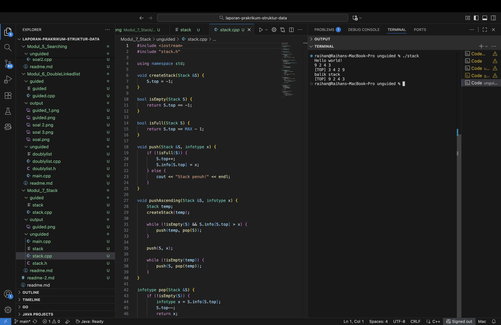
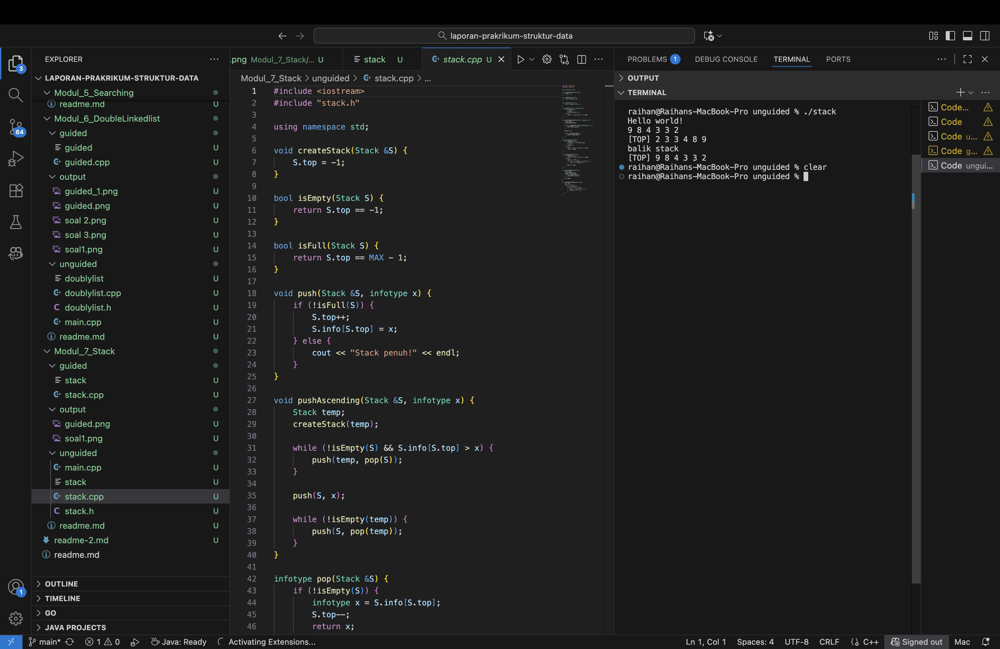
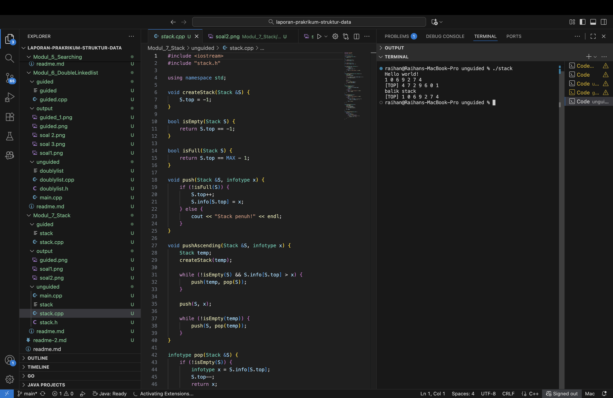

# <h1 align="center">Laporan Praktikum Modul 7 <br>Stack</h1>

<p align="center">Raihan Adi Arba - 103112400071</p>

## Dasar Teori

Stack adalah struktur data di mana elemen hanya dapat ditambahkan atau dihapus dari satu ujung yang disebut puncak (top). Polanya mengikuti Last In, First Out (LIFO), sehingga elemen terakhir yang dimasukkan menjadi yang pertama keluar. Operasi dasar meliputi push (menambah elemen di puncak), pop (menghapus elemen teratas), peek/top (melihat elemen teratas tanpa menghapus), dan isEmpty (memeriksa apakah stack kosong).

Implementasi umum dilakukan dengan array—menggunakan variabel top sebagai indeks puncak dan berisiko overflow jika kapasitas tetap terlampaui—atau dengan linked list, di mana setiap node baru disisipkan di awal sehingga LIFO tetap terjaga tanpa batasan ukuran statis.

Stack sering dipakai untuk mengelola data bertumpuk atau proses rekursif, seperti call stack, konversi/evaluasi ekspresi (infix ke postfix), dan fitur undo/redo. Kelebihannya adalah kesederhanaan dan efisiensi operasi di puncak; kelemahannya akses ke elemen selain puncak terbatas, dan pada implementasi array ada potensi overflow.

## Guided

### Soal 1 Stack

```cpp
#include <iostream>
using namespace std;

// Struktur Node
struct Node {
    int data;
    Node* next;
};

bool isEmpty(Node *top) {
    return top == nullptr;
}

void push(Node *&top, int data) {
    Node* newNode = new Node();
    newNode->data = data;
    newNode->next = top;
    top = newNode;
}

int pop(Node *&top)
{
    if (isEmpty(top)){
        cout << "Stack Kosong, Tidak Bisa Pop" << endl;
        return 0;
    }

    int poppedData = top->data;
    Node *temp = top;
    top = top->next;

    delete temp;
    return poppedData;
}

void show(Node *top) {
    if (isEmpty(top)) {
        cout << "Stack kosong.\n";
        return;
    }

    cout << "TOP -> ";
    Node *temp = top;

    while (temp != nullptr) {
        cout << temp->data << " -> ";
        temp = temp->next;
    }
    cout << "NULL" << endl;
}

int main(){
    Node *stack = nullptr;

    push(stack, 10);
    push(stack, 20);
    push(stack, 30);

    cout << "Isi Stack setelah push:\n";
    show(stack);

    cout << "Pop: " << pop(stack) << endl;

    cout << "Menampilkan sisa stack: \n";
    show(stack);

    return 0;

}
```

> 

Contoh ini menunjukkan implementasi Stack menggunakan linked list di C++. Setiap node berisi data (nilai) dan next (penunjuk node berikutnya). Fungsi dasar diimplementasikan antara lain push() untuk menambah elemen di puncak, pop() untuk menghapus dan mengembalikan elemen teratas, isEmpty() untuk memeriksa apakah stack kosong, serta show() untuk menampilkan isi stack dari puncak ke bawah. Pada main(), program diuji dengan memasukkan 10, 20, 30, menampilkan stack, melakukan pop, lalu menampilkan isi yang tersisa.

## Unguided

### Soal 1

Buatlah ADT Stack menggunakan ARRAY sebagai berikut di dalam file “stack.h”

```
Type infotype : integer
Type Stack <
info : array [20] of integer
top : integer
>
procedure CreateStack( input/output S : Stack )
procedure push(input/output S : Stack,
	input x : infotype)
function pop(input/output t S : Stack )
	→ infotype
procedure printInfo( input S : Stack )
procedure balikStack(input/output S :
	Stack )
```

Buatlah implementasi ADT Stack menggunakan Array pada file “stack.cpp” dan “main.cpp”

```cpp
int main()
{
    cout << "Hello world!" <<
endl;
    Stack S;
    createStack(S);
    Push(S,3);
    Push(S,4);
    Push(S,8);
    pop(S)
    Push(S,2);
    Push(S,3);
    pop(S);
    Push(S,9);
    printInfo(S);
    cout<<"balik stack"<<endl;
    balikStack(S);
    printInfo(S);
    return 0;
}
```

stack.h

```
#ifndef STACK_H
#define STACK_H

#define MAX 20
typedef int infotype;

typedef struct {
    infotype info[MAX];
    int top;
} Stack;

void createStack(Stack &S);
bool isEmpty(Stack S);
bool isFull(Stack S);
void push(Stack &S, infotype x);
infotype pop(Stack &S);
void printInfo(Stack S);
void balikStack(Stack &S);

#endif
```

stack.cpp

```
#include <iostream>
#include "stack.h"

using namespace std;

void createStack(Stack &S) {
    S.top = -1;
}

bool isEmpty(Stack S) {
    return S.top == -1;
}

bool isFull(Stack S) {
    return S.top == MAX - 1;
}


void push(Stack &S, infotype x) {
    if (!isFull(S)) {
        S.top++;
        S.info[S.top] = x;
    } else {
        cout << "Stack penuh!" << endl;
    }
}

infotype pop(Stack &S) {
    if (!isEmpty(S)) {
        infotype x = S.info[S.top];
        S.top--;
        return x;
    } else {
        cout << "Stack kosong!" << endl;
        return -9999;
    }
}

void printInfo(Stack S) {
    if (isEmpty(S)) {
        cout << "Stack kosong!" << endl;
    } else {
        cout << "[TOP] ";
        for (int i = S.top; i >= 0; i--) {
            cout << S.info[i] << " ";
        }
        cout << endl;
    }
}

void balikStack(Stack &S) {
    Stack temp;
    createStack(temp);
    while (!isEmpty(S)) {
        push(temp, pop(S));
    }
    S = temp;
}
```

main.cpp

```
#include <iostream>
#include "stack.h"

using namespace std;

void createStack(Stack &S) {
    S.top = -1;
}

bool isEmpty(Stack S) {
    return S.top == -1;
}

bool isFull(Stack S) {
    return S.top == MAX - 1;
}


void push(Stack &S, infotype x) {
    if (!isFull(S)) {
        S.top++;
        S.info[S.top] = x;
    } else {
        cout << "Stack penuh!" << endl;
    }
}

infotype pop(Stack &S) {
    if (!isEmpty(S)) {
        infotype x = S.info[S.top];
        S.top--;
        return x;
    } else {
        cout << "Stack kosong!" << endl;
        return -9999;
    }
}

void printInfo(Stack S) {
    if (isEmpty(S)) {
        cout << "Stack kosong!" << endl;
    } else {
        cout << "[TOP] ";
        for (int i = S.top; i >= 0; i--) {
            cout << S.info[i] << " ";
        }
        cout << endl;
    }
}

void balikStack(Stack &S) {
    Stack temp;
    createStack(temp);
    while (!isEmpty(S)) {
        push(temp, pop(S));
    }
    S = temp;
}
```

> Output
> 

Pada Soal 1 ditunjukkan implementasi ADT Stack menggunakan array sebagai tempat penyimpanan. Fungsi createStack() menginisialisasi stack dengan top = -1 sehingga stack dianggap kosong. Operasi push() menambah elemen di puncak, pop() mengeluarkan elemen teratas, printInfo() menampilkan isi stack dari atas ke bawah, dan balikStack() membalik urutan elemen. Saat dijalankan program mencetak "Hello world!" lalu menampilkan isi stack sebelum dan sesudah pembalikan — awalnya [TOP] 9 2 4 3 dan setelah dibalik menjadi [TOP] 3 4 2 9.

### Soal 2

Tambahkan prosedur pushAscending( in/out S : Stack, in x : integer)

```
int main()
{
	cout << "Hello world!" << endl;
	Stack S;
	createStack(S);
	pushAscending(S,3);
	pushAscending(S,4);
	pushAscending(S,8);
	pushAscending(S,2);
	pushAscending(S,3);
	pushAscending(S,9);
	printInfo(S);
	cout<<"balik stack"<<endl;
	balikStack(S);
	printInfo(S);
	return 0;
}
```

main.cpp

```
#include <iostream>
#include "stack.h"

using namespace std;

int main() {
    cout << "Hello world!" << endl;

    Stack S;
    createStack(S);
    pushAscending(S, 3);
    pushAscending(S, 4);
    pushAscending(S, 8);
    pushAscending(S, 2);
    pushAscending(S, 3);
    pushAscending(S, 9);
    printInfo(S);

    cout << "balik stack" << endl;
    balikStack(S);
    printInfo(S);
    return 0;
}
```

stack.cpp

```
#include <iostream>
#include "stack.h"

using namespace std;

void createStack(Stack &S) {
    S.top = -1;
}

bool isEmpty(Stack S) {
    return S.top == -1;
}

bool isFull(Stack S) {
    return S.top == MAX - 1;
}

void push(Stack &S, infotype x) {
    if (!isFull(S)) {
        S.top++;
        S.info[S.top] = x;
    } else {
        cout << "Stack penuh!" << endl;
    }
}

void pushAscending(Stack &S, infotype x) {
    Stack temp;
    createStack(temp);

    while (!isEmpty(S) && S.info[S.top] > x) {
        push(temp, pop(S));
    }

    push(S, x);

    while (!isEmpty(temp)) {
        push(S, pop(temp));
    }
}

infotype pop(Stack &S) {
    if (!isEmpty(S)) {
        infotype x = S.info[S.top];
        S.top--;
        return x;
    } else {
        cout << "Stack kosong!" << endl;
        return -9999;
    }
}

void printInfo(Stack S) {
    if (isEmpty(S)) {
        cout << "Stack kosong!" << endl;
    } else {
        cout << "[TOP] ";
        for (int i = S.top; i >= 0; i--) {
            cout << S.info[i] << " ";
        }
        cout << endl;
    }
}

void balikStack(Stack &S) {
    Stack temp;
    createStack(temp);
    while (!isEmpty(S)) {
        push(temp, pop(S));
    }
    S = temp;
}
```

stack.h

```
#ifndef STACK_H
#define STACK_H

#define MAX 20
typedef int infotype;

typedef struct {
    infotype info[MAX];
    int top;
} Stack;

void createStack(Stack &S);
bool isEmpty(Stack S);
bool isFull(Stack S);
void push(Stack &S, infotype x);
infotype pop(Stack &S);
void printInfo(Stack S);
void balikStack(Stack &S);
void pushAscending(Stack &S, infotype x);
#endif
```

> Output
> 

Di soal dua ditambahkan prosedur baru bernama pushAscending() yang menempatkan elemen sehingga stack tetap terurut secara menaik. Dengan kata lain, setiap nilai baru disisipkan pada posisi yang mempertahankan urutan dari kecil ke besar, bukan langsung ditumpuk seperti push() biasa. Saat dijalankan, isi stack akan tampil sebagai [TOP] 9 8 4 3 3 2, dan setelah memanggil balikStack() menjadi [TOP] 2 3 3 4 8 9.

### Soal 3

Tambahkan prosedur getInputStream( in/out S : Stack ). Prosedur akan terus membaca dan menerima input user dan memasukkan setiap input ke dalam stack hingga user menekan tombol enter. Contoh: gunakan cin.get() untuk mendapatkan inputan user.

```
int main()
{
	cout << "Hello world!" << endl;
	Stack S;
	createStack(S);
	getInputStream(S);
	printInfo(S);
	cout<<"balik stack"<<endl;
	balikStack(S);
	printInfo(S);
	return 0;
}
```

main.cpp

```
#include <iostream>
#include "stack.h"

using namespace std;

int main() {
    cout << "Hello world!" << endl;
    Stack S;
    createStack(S);

    getInputStream(S);
    printInfo(S);

    cout << "balik stack" << endl;
    balikStack(S);
    printInfo(S);
    return 0;
}
```

stack.cpp

```
#include <iostream>
#include "stack.h"

using namespace std;

void createStack(Stack &S) {
    S.top = -1;
}

bool isEmpty(Stack S) {
    return S.top == -1;
}

bool isFull(Stack S) {
    return S.top == MAX - 1;
}

void push(Stack &S, infotype x) {
    if (!isFull(S)) {
        S.top++;
        S.info[S.top] = x;
    } else {
        cout << "Stack penuh!" << endl;
    }
}

void pushAscending(Stack &S, infotype x) {
    Stack temp;
    createStack(temp);

    while (!isEmpty(S) && S.info[S.top] > x) {
        push(temp, pop(S));
    }

    push(S, x);

    while (!isEmpty(temp)) {
        push(S, pop(temp));
    }
}

infotype pop(Stack &S) {
    if (!isEmpty(S)) {
        infotype x = S.info[S.top];
        S.top--;
        return x;
    } else {
        cout << "Stack kosong!" << endl;
        return -9999;
    }
}

void printInfo(Stack S) {
    if (isEmpty(S)) {
        cout << "Stack kosong!" << endl;
    } else {
        cout << "[TOP] ";
        for (int i = S.top; i >= 0; i--) {
            cout << S.info[i] << " ";
        }
        cout << endl;
    }
}

void balikStack(Stack &S) {
    Stack temp;
    createStack(temp);
    while (!isEmpty(S)) {
        push(temp, pop(S));
    }
    S = temp;
}

void getInputStream(Stack &S) {
    char ch;
    while (true) {
        ch = cin.get();
        if (ch == '\n') break;
        if (ch >= '0' && ch <= '9') {
            push(S, ch - '0');
        }
    }
}
```

stack.h

```
#ifndef STACK_H
#define STACK_H

#define MAX 20
typedef int infotype;

typedef struct {
    infotype info[MAX];
    int top;
} Stack;

void createStack(Stack &S);
bool isEmpty(Stack S);
bool isFull(Stack S);
void push(Stack &S, infotype x);
infotype pop(Stack &S);
void printInfo(Stack S);
void balikStack(Stack &S);
void pushAscending(Stack &S, infotype x);
void getInputStream(Stack &S);

#endif
```

> Output
> 

Pada soal tiga ditambahkan prosedur getInputStream() yang membaca input langsung dari keyboard sehingga pengguna tidak perlu memanggil push() berulang kali. Pengguna dapat mengetik serangkaian digit sekaligus (mis. 4729601) dan setiap digit akan dimasukkan sebagai elemen terpisah ke dalam stack. Setelah input selesai, program menampilkan isi stack dengan printInfo() lalu membalik urutannya menggunakan balikStack(); outputnya sebelum dan sesudah pembalikan adalah [TOP] 1 0 6 9 2 7 4 dan [TOP] 4 7 2 9 6 0 1.

## Referensi

[1] Modul Praktikum 4 – Stack, Universitas Negeri Malang. Modul Struktur Data (PDF) https://elektro.um.ac.id/wp-content/uploads/2016/04/Struktur-Data-Modul-Praktikum-4-Stack.pdf

[2] Struktur Data Stack: Pengertian, Karakteristik, dan Kegunaannya, Trivusi. https://trivusi.web.id/2022/07/struktur-data-stack.html

[3] “Penggunaan Struktur Data Stack dalam Pemrograman C++ dengan Pendekatan Array dan Linked List”, Jurnal JUTECH. [https://jurnal.stkippersada.ac.id/jurnal/index.php/jutech/article/download/4263/pdf]
